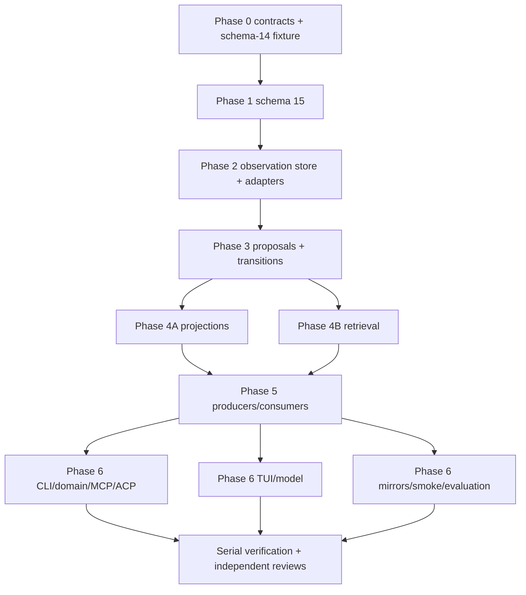

# W08 — Career Memory, preference calibration, and voice/positioning

## Outcome and authority boundary

W08 adds local, profile-scoped, attributable, reversible guidance. It does not add a second candidate truth store, silently learn hidden preferences, fine-tune a model, or mutate search exclusions, profile facts, proof points, saved-search configuration, application status, artifact content, or upstream outcome records.

The end-to-end result is:

1. Direct save/skip/apply decisions and artifact approve/reject/edit feedback can carry typed reasons and an optional SQLite-only private note.
2. Existing W05 outreach outcomes, W06 lifecycle/application observations, and W07 interview observations are adapted at read time into one observation wire shape; they are not copied into W08 tables.
3. Derived search and writing proposals cite exact current source versions. Every proposal starts inactive and becomes effective only after a trusted CLI/TUI human accepts it.
4. Accepted guidance is append-only, reversible, scoped, freshness-bounded, conflict-checked, and excluded when its evidence is corrected, stale, protected/sensitive, or cross-profile.
5. A deterministic career brief and voice/positioning guide cite canonical source IDs and active rule IDs. They influence selection, ordering, framing, and style only. Canonical proofs remain the exclusive authority for factual claims.
6. Discovery gets a visible bounded ranking adjustment without changing `jobos.fit-score.v1`; scoring gets explanation only; tailoring, outreach, and interview preparation get only relevant active guidance and bounded recent context.
7. All core behavior remains deterministic and local without an LLM, network, API key, telemetry, cloud sync, or external action. A configured LLM may draft a `proposed` record only and receives no private notes.

### Three layers

| Layer | Authority | W08 behavior |
|---|---|---|
| Canonical | Existing `profiles.preferences_json`, `proof_points`, `profile_resume_revisions`, `answers`, `jobs`, `saved_searches`, `artifacts`, packets/receipts, and upstream domain records | Read by ID and hash. Never copied as new facts and never mutated by W08. |
| Observational | W08-native direct feedback plus read adapters over W05/W06/W07 observations | Append-only attribution. Corrections append. Private notes are excluded from derivation, retrieval, audit payloads, and mirrors. |
| Derived | W08 proposals, transition history, active-rule resolution, career brief, voice/positioning guide, and retrieval packets | Inactive before trusted acceptance. Deterministic, cited, scoped, stale-aware, reversible, and non-causal. |

Canonical source references use existing identities, not invented fact rows:

- proof: `proof_points.id` plus a SHA-256 of the current canonical row;
- profile field: `profile:<profileId>#/preferences/<JSON-pointer>` plus the value hash;
- current search strategy: `profile:<profileId>#/preferences/searchStrategy` and safe saved-search IDs/config hashes;
- job/application/artifact: the existing entity ID and exact status-event, receipt, artifact-revision, or content-hash version;
- W05/W06/W07: the published schema literal and exact observation/version ID.

A profile field reference is a citation, not a new canonical fact ID.

## Frozen schemas, enums, IDs, and hashes

Create `src/career-memory-contract.js` for constants and shape validators. Schema literals are:

```text
jobos.career-memory-observation.v1
jobos.career-memory-observation-list.v1
jobos.career-memory-proposal.v1
jobos.career-memory-proposal-list.v1
jobos.career-memory-transition.v1
jobos.career-memory-active-rules.v1
jobos.career-brief.v1
jobos.voice-positioning-guide.v1
jobos.career-memory-retrieval.v1
jobos.career-memory-validation.v1
jobos.job-feedback-input.v1
jobos.artifact-feedback-input.v1
jobos.memory-proposal-input.v1
```

### Observation enums

W08-native event types:

```text
job_saved
job_skipped
job_applied
artifact_approved
artifact_rejected
artifact_edited
```

Read-adapted event types retain upstream meaning:

- W05: `reply_positive | reply_neutral | reply_negative | meeting_booked | no_response | bounced | declined`;
- W06: `application_status_changed | submission_attested | configured_submission_confirmed | receipt_confirmed`; the companion `interview_debrief_recorded` lifecycle trigger is suppressed by this adapter because the richer W07 adapter below owns that semantic event.
- W07 adapter wire `eventType` is exactly the existing lifecycle literal `interview_debrief_recorded`. The W07 source wire `jobos.interview-observation.v1` has no `eventType`; it exposes `observedQuestions`, `observedOutcome`, `proofGaps`, and `storyUses` at top level. The W08 adapter copies those fields into its `payload`, preserves `observedOutcome.type` as `advanced | no_change | rejected | withdrawn | unknown`, and never claims that the normalized event type or payload nesting came from the W07 source wire.

Job reason codes:

```text
role_fit
seniority_fit
company_stage
industry
mission
location
work_model
compensation
skills_match
timing
trust_signal
red_flag
other
```

Artifact reason codes:

```text
tone
length
opening
closing
structure
vocabulary
specificity
evidence_selection
positioning
unsupported_claim
factual_error
formatting
other
```

Rules:

- job save/skip/apply feedback requires 1–5 unique job reason codes;
- artifact reject/edit feedback requires 1–5 unique artifact reason codes; approve permits zero reasons but cannot support a proposal unless at least one structured signal is present;
- `other` requires a non-empty public explanation in the input payload; it is not taken from the private note;
- unknown reason codes reject the entire operation before a write;
- reason order is canonical enum order, not caller order.

`actor` is a non-empty attributable identity. `source` is derived at the trusted boundary and is never accepted from a CLI file or domain-tool argument. W08 native writes permit `cli` and `tui`; agent-mediated operations may only create proposals and are forced to `actor/source = mcp|acp`.

### Proposal enums and payloads

```text
domain: search | writing
status: proposed | accepted | rejected | superseded | revoked
confidenceBand: low | medium | high
conflictState: none | present
scope:
  search
  resume
  cover_letter
  outreach
  interview_prep
  writing_global
search ruleType:
  role_family | seniority | company_stage | industry | mission |
  location | work_model | compensation | skill | timing | trust_risk
writing ruleType:
  tone | length | opening | closing | avoid_term | avoid_claim |
  positioning_priority | approved_exemplar
```

Allowed normalized `value` objects:

```json
{"polarity":"prefer|avoid","value":"non-empty normalized text","match":"exact|token"}
{"value":"concise|warm|analytical|direct|narrative|formal"}
{"minWords":0,"maxWords":120}
{"value":"direct|context_first|proof_first|gratitude|call_to_action|none"}
{"terms":["normalized term"]}
{"claimPattern":"normalized text","reasonCode":"unsupported|unwanted_positioning"}
{"theme":"non-empty text","proofPointIds":["proof-id"]}
{"artifactId":"artifact-id","revision":2,"contentHash":"sha256","startLine":4,"endLine":8,"excerptHash":"sha256"}
```

The first shape is used only by search rules. Tone, length, opening/closing, avoid, positioning, and exemplar shapes are accepted only by their matching rule type. `length` requires integers with `0 <= minWords <= maxWords <= 1200`. `terms` has 1–20 non-empty values. Positioning proof IDs must be active, verified, same-profile proof points at acceptance and retrieval. An exemplar must be an approved same-profile exact artifact revision; line bounds and excerpt hash are recomputed at acceptance and retrieval.

`writing_global` is invalid for `approved_exemplar`. An artifact-type rule never becomes global by resolution. A global rule is a separate proposal and acceptance. Global promotion requires two active accepted artifact-specific rules with the same scope-neutral conflict key across at least two artifact scopes; it cannot be inferred from one artifact type. Those source rules remain independently active in their artifact scopes; creating or accepting the global proposal does not supersede them.

`jobos.memory-proposal-input.v1` is the only proposal-create wire shape:

```json
{
  "schema": "jobos.memory-proposal-input.v1",
  "domain": "search|writing",
  "scope": "search|resume|cover_letter|outreach|interview_prep|writing_global",
  "ruleType": "one frozen rule type",
  "value": {},
  "rationale": "public, non-causal explanation",
  "evidence": [
    {
      "observationSchema": "published schema literal",
      "observationId": "exact observation ID",
      "polarity": "support|conflict"
    }
  ],
  "referenceId": "caller-stable-id",
  "createdAt": "optional RFC3339; server time when omitted"
}
```

Unknown keys, caller-supplied confidence/status/actor/source, empty evidence, duplicate evidence IDs, and non-canonical values are rejected. The implementation resolves source entity/version/time/hash and computes confidence, conflict, freshness, rule key, evidence hash, proposal hash, ID, and initial `proposed` transition; callers cannot supply them.

### Deterministic serialization

Add one recursive canonical JSON serializer in `src/career-memory-contract.js`: object keys sort lexicographically, arrays preserve semantically normalized order, numbers remain JSON numbers, and `undefined` is rejected. Keep it intentionally separate from `src/packets.js::canonicalJson`, which normalizes `undefined` to `null`; add a code comment documenting that W08 rejects rather than rewrites undefined integrity inputs. Content/evidence/state hashes are full lowercase SHA-256 hex of UTF-8 canonical JSON. Existing `id(prefix, seed)` remains the ID convention, so IDs use its 12-hex suffix:

```text
memory observation: id('memory_observation', profileId|sourceSchema|sourceEntityType|sourceEntityId|sourceVersionId|eventType|referenceId)
proposal:           id('memory_proposal', profileId|domain|scope|ruleType|ruleKey|evidenceHash|createdAt)
transition:         id('memory_transition', proposalId|sequence|toStatus|referenceId)
projection:         id('memory_projection', profileId|projectionType|revision|sourceStateHash)
```

`rule_key` hashes domain, scope, rule type, and the complete normalized value including polarity. `conflict_key` is deliberately scope-neutral: it hashes domain, rule type, and the normalized target with polarity removed. This permits equality checks for explicit global promotion across artifact scopes. Every ordinary conflict, contradiction, active-rule replacement, and supersession lookup is nevertheless scope-local and must match the tuple `(profile_id, scope, conflict_key)`; a matching conflict key in another scope never blocks or supersedes that scope. IDs are identifiers, not integrity hashes; full SHA-256 columns provide integrity.

All timestamps are normalized RFC3339 UTC. Stable ordering always adds ID as the final tie-breaker.

## Schema 14 → 15 migration

Add `migrateW08CareerMemory(db)` in `src/db.js`, call it after existing schema creation and before semantic backfills, and set `meta.schema_version` to `15`. New workspaces create the same tables from the base schema string. This migration is additive: no existing column/table rewrite and no historical event copy. Existing W05/W06/W07 records remain their own authority and are visible through adapters.

Use this exact logical DDL (format may follow `src/db.js` style, but names, columns, checks, keys, and indexes are frozen):

```sql
CREATE TABLE IF NOT EXISTS career_memory_observations (
  id TEXT PRIMARY KEY,
  profile_id TEXT NOT NULL,
  schema_version INTEGER NOT NULL DEFAULT 1 CHECK(schema_version=1),
  event_type TEXT NOT NULL CHECK(event_type IN (
    'job_saved','job_skipped','job_applied',
    'artifact_approved','artifact_rejected','artifact_edited'
  )),
  source_schema TEXT NOT NULL,
  source_entity_type TEXT NOT NULL CHECK(source_entity_type IN ('job','application','artifact')),
  source_entity_id TEXT NOT NULL,
  source_version_id TEXT NOT NULL,
  source_revision INTEGER CHECK(source_revision IS NULL OR source_revision > 0),
  source_content_hash TEXT NOT NULL DEFAULT '',
  occurred_at TEXT NOT NULL,
  recorded_at TEXT NOT NULL,
  actor TEXT NOT NULL,
  source TEXT NOT NULL CHECK(source IN ('cli','tui')),
  reason_codes_json TEXT NOT NULL DEFAULT '[]',
  signal_json TEXT NOT NULL DEFAULT '[]',
  public_explanation TEXT NOT NULL DEFAULT '',
  private_note TEXT NOT NULL DEFAULT '',
  payload_json TEXT NOT NULL DEFAULT '{}',
  reference_id TEXT NOT NULL,
  supersedes_observation_id TEXT,
  undoes_observation_id TEXT,
  correction_reason TEXT NOT NULL DEFAULT '',
  observation_hash TEXT NOT NULL,
  UNIQUE(id, profile_id),
  UNIQUE(profile_id, reference_id),
  FOREIGN KEY(profile_id) REFERENCES profiles(id),
  FOREIGN KEY(supersedes_observation_id, profile_id)
    REFERENCES career_memory_observations(id, profile_id),
  FOREIGN KEY(undoes_observation_id, profile_id)
    REFERENCES career_memory_observations(id, profile_id),
  CHECK(supersedes_observation_id IS NULL OR correction_reason != '')
);
CREATE UNIQUE INDEX IF NOT EXISTS career_memory_observations_one_successor_idx
  ON career_memory_observations(supersedes_observation_id)
  WHERE supersedes_observation_id IS NOT NULL;
CREATE INDEX IF NOT EXISTS career_memory_observations_profile_time_idx
  ON career_memory_observations(profile_id, occurred_at, id);
CREATE INDEX IF NOT EXISTS career_memory_observations_source_idx
  ON career_memory_observations(profile_id, source_schema, source_entity_type, source_entity_id, source_version_id);

CREATE TABLE IF NOT EXISTS career_memory_proposals (
  id TEXT PRIMARY KEY,
  profile_id TEXT NOT NULL,
  schema_version INTEGER NOT NULL DEFAULT 1 CHECK(schema_version=1),
  domain TEXT NOT NULL CHECK(domain IN ('search','writing')),
  scope TEXT NOT NULL CHECK(scope IN ('search','resume','cover_letter','outreach','interview_prep','writing_global')),
  rule_type TEXT NOT NULL CHECK(rule_type IN (
    'role_family','seniority','company_stage','industry','mission','location',
    'work_model','compensation','skill','timing','trust_risk',
    'tone','length','opening','closing','avoid_term','avoid_claim',
    'positioning_priority','approved_exemplar'
  )),
  value_json TEXT NOT NULL,
  rule_key TEXT NOT NULL,
  conflict_key TEXT NOT NULL,
  rationale TEXT NOT NULL,
  confidence_milli INTEGER NOT NULL CHECK(confidence_milli BETWEEN 0 AND 1000),
  confidence_band TEXT NOT NULL CHECK(confidence_band IN ('low','medium','high')),
  conflict_state TEXT NOT NULL CHECK(conflict_state IN ('none','present')),
  evidence_hash TEXT NOT NULL,
  evidence_fresh_until TEXT NOT NULL,
  created_at TEXT NOT NULL,
  actor TEXT NOT NULL,
  source TEXT NOT NULL CHECK(source IN ('cli','tui','mcp','acp','deterministic')),
  proposal_hash TEXT NOT NULL,
  UNIQUE(id, profile_id),
  FOREIGN KEY(profile_id) REFERENCES profiles(id),
  CHECK((domain='search' AND scope='search') OR (domain='writing' AND scope!='search')),
  CHECK(NOT (rule_type='approved_exemplar' AND scope='writing_global'))
);
CREATE INDEX IF NOT EXISTS career_memory_proposals_profile_rule_idx
  ON career_memory_proposals(profile_id, domain, scope, conflict_key, created_at, id);
CREATE INDEX IF NOT EXISTS career_memory_proposals_profile_fresh_idx
  ON career_memory_proposals(profile_id, evidence_fresh_until, id);

CREATE TABLE IF NOT EXISTS career_memory_proposal_evidence (
  proposal_id TEXT NOT NULL,
  profile_id TEXT NOT NULL,
  position INTEGER NOT NULL CHECK(position >= 0),
  observation_schema TEXT NOT NULL,
  observation_id TEXT NOT NULL,
  source_entity_type TEXT NOT NULL,
  source_entity_id TEXT NOT NULL,
  source_version_id TEXT NOT NULL,
  occurred_at TEXT NOT NULL,
  polarity TEXT NOT NULL CHECK(polarity IN ('support','conflict')),
  weight INTEGER NOT NULL CHECK(weight IN (1,2)),
  evidence_hash TEXT NOT NULL,
  PRIMARY KEY(proposal_id, position),
  UNIQUE(proposal_id, observation_schema, observation_id),
  FOREIGN KEY(proposal_id, profile_id)
    REFERENCES career_memory_proposals(id, profile_id),
  FOREIGN KEY(profile_id) REFERENCES profiles(id)
);
CREATE INDEX IF NOT EXISTS career_memory_proposal_evidence_source_idx
  ON career_memory_proposal_evidence(profile_id, observation_schema, observation_id);

CREATE TABLE IF NOT EXISTS career_memory_proposal_transitions (
  id TEXT PRIMARY KEY,
  proposal_id TEXT NOT NULL,
  profile_id TEXT NOT NULL,
  sequence INTEGER NOT NULL CHECK(sequence > 0),
  from_status TEXT CHECK(from_status IS NULL OR from_status IN ('proposed','accepted','rejected','superseded','revoked')),
  to_status TEXT NOT NULL CHECK(to_status IN ('proposed','accepted','rejected','superseded','revoked')),
  reason TEXT NOT NULL DEFAULT '',
  reference_id TEXT NOT NULL,
  replacement_proposal_id TEXT,
  undoes_transition_id TEXT,
  actor TEXT NOT NULL,
  source TEXT NOT NULL CHECK(source IN ('cli','tui','mcp','acp','deterministic')),
  occurred_at TEXT NOT NULL,
  transition_hash TEXT NOT NULL,
  UNIQUE(id, profile_id),
  UNIQUE(id, proposal_id, profile_id),
  UNIQUE(proposal_id, sequence),
  UNIQUE(profile_id, reference_id),
  FOREIGN KEY(proposal_id, profile_id)
    REFERENCES career_memory_proposals(id, profile_id),
  FOREIGN KEY(replacement_proposal_id, profile_id)
    REFERENCES career_memory_proposals(id, profile_id),
  FOREIGN KEY(undoes_transition_id, profile_id)
    REFERENCES career_memory_proposal_transitions(id, profile_id),
  CHECK((sequence=1 AND from_status IS NULL AND to_status='proposed') OR sequence>1)
);
CREATE INDEX IF NOT EXISTS career_memory_transitions_resolve_idx
  ON career_memory_proposal_transitions(profile_id, proposal_id, sequence DESC);

CREATE TABLE IF NOT EXISTS career_memory_projection_revisions (
  id TEXT PRIMARY KEY,
  profile_id TEXT NOT NULL,
  projection_type TEXT NOT NULL CHECK(projection_type IN ('career_brief','voice_positioning_guide')),
  revision INTEGER NOT NULL CHECK(revision > 0),
  schema_version INTEGER NOT NULL DEFAULT 1 CHECK(schema_version=1),
  as_of TEXT NOT NULL,
  source_state_hash TEXT NOT NULL,
  content_hash TEXT NOT NULL,
  document_json TEXT NOT NULL,
  created_at TEXT NOT NULL,
  UNIQUE(id, profile_id),
  UNIQUE(profile_id, projection_type, revision),
  UNIQUE(profile_id, projection_type, source_state_hash),
  FOREIGN KEY(profile_id) REFERENCES profiles(id)
);
CREATE INDEX IF NOT EXISTS career_memory_projection_current_idx
  ON career_memory_projection_revisions(profile_id, projection_type, revision DESC);

CREATE TABLE IF NOT EXISTS career_memory_projection_sources (
  projection_id TEXT NOT NULL,
  profile_id TEXT NOT NULL,
  position INTEGER NOT NULL CHECK(position >= 0),
  source_kind TEXT NOT NULL CHECK(source_kind IN (
    'profile_field','proof_point','saved_search','accepted_rule','observation','artifact_revision'
  )),
  source_id TEXT NOT NULL,
  source_version_id TEXT NOT NULL DEFAULT '',
  source_hash TEXT NOT NULL,
  PRIMARY KEY(projection_id, position),
  UNIQUE(projection_id, source_kind, source_id, source_version_id),
  FOREIGN KEY(projection_id, profile_id)
    REFERENCES career_memory_projection_revisions(id, profile_id),
  FOREIGN KEY(profile_id) REFERENCES profiles(id)
);
```

Run `PRAGMA foreign_key_check` before accepting the migration. `migrateW08CareerMemory` is safe on every open and creates no observation, proposal, transition, or projection rows. A reopen of schema 15 is byte-stable for all W08 rows.

### Historical migration fixture

Before implementation changes, generate and retain `tests/fixtures/w08-schema14.sqlite` from exact base `82b685b` through current public/domain APIs, not hand SQL. It must contain:

- profiles `alpha` and `beta` with distinct preferences;
- active/retired/unverified proofs in both profiles;
- one saved and one archived job per profile;
- one two-revision artifact series with an approved exact revision and one rejected artifact;
- one W05 outreach thread plus original and corrected outcome;
- W06 application/status history, packet, attestation receipt, and current lifecycle task;
- one W07 story and a debrief with two revisions/current markers;
- `meta.schema_version=14` and no W08 tables.

`W08-MIGRATE-01` copies this immutable fixture to a temp workspace, opens it, asserts schema 15, empty `foreign_key_check`, all existing table row counts/content hashes unchanged, and zero W08 rows. `W08-MIGRATE-02` reopens it and asserts no new rows/audits/mirrors and byte-equivalent W08 table projections. Never regenerate the fixture with schema-15 code.

## Observation wire and writer ownership

### Common wire shape

`listMemoryObservations` returns:

```json
{
  "schema":"jobos.career-memory-observation-list.v1",
  "observationSchema":"jobos.career-memory-observation.v1",
  "profileId":"alpha",
  "period":{"start":"...","end":"...","sinceDays":365},
  "filters":{"types":[],"currentOnly":true},
  "observations":[{
    "schema":"jobos.career-memory-observation.v1",
    "id":"stable adapter or W08 ID",
    "profileId":"alpha",
    "eventType":"job_saved",
    "occurredAt":"...",
    "recordedAt":"...",
    "actor":"user",
    "source":"tui",
    "sourceEntity":{"type":"job","id":"job-id","versionId":"audit/status/receipt/revision-id","revision":null,"contentHash":"..."},
    "reasonCodes":["role_fit"],
    "signals":[],
    "publicExplanation":"",
    "hasPrivateNote":false,
    "current":true,
    "supersedesObservationId":null,
    "payload":{},
    "interpretation":"attributed_observation_only_no_preference_or_causal_claim",
    "externalSideEffects":"none"
  }],
  "excluded":{"superseded":0,"outsidePeriod":0,"privateNotes":0}
}
```

The normal list never returns private-note text. `jobos feedback observations show <id> --profile <id> --include-private-note --json` is the only public private-note read and is trusted CLI-only. There is no MCP/ACP private-note field or tool.

### Exact source map

| Input | Existing owner | W08 integration | Stable source/version | Correction/current rule |
|---|---|---|---|---|
| Save | `src/jobs.js::updateJobStatus(...,'saved')` | Add optional `memoryFeedback`; TUI must collect it before write. Canonical status and W08 event commit together. | job ID + returned `job.status_changed` audit ID | W08 event correction chain only; never rewrite job history. |
| Skip | `updateJobStatus(...,'archived')` | Same; wire event is `job_skipped`, while canonical status remains `archived`. | job ID + audit ID | Same. Dedupe archival does not create feedback. |
| Apply | `src/packets.js::attestApplicationSubmitted` | Add optional `memoryFeedback`; packet receipt/status and W08 event commit together. A bare `applications update --status applied` is a W06 lifecycle observation, not explicit job feedback. | application ID + exact user-attestation receipt ID | Exact receipt replay returns the same W08 event. |
| Manual/backfilled job feedback | W08 | `recordJobFeedback` validates that save→`jobs.status=saved`, skip→`archived`, and apply→owned application at applied-or-later/receipt evidence. It never changes canonical state. | required caller `referenceId` + current canonical version | Exact reference+hash replay is idempotent; conflict rejects. |
| Artifact approve/reject | `src/artifacts.js::_reviewArtifact` | Extend with `memoryFeedback`; review update, audit, and W08 event share one `guardedWrite`. Do not add reason/private-note columns to `artifacts`. | exact artifact ID/revision/content hash + review audit ID | Existing idempotent approval returns existing observation; conflicting feedback fails. |
| Artifact edit | `src/artifacts.js::ingestEditedArtifact` | Collect feedback before editor ingestion; refactor creation/edit audit/W08 event into one `guardedWrite`. | new artifact ID/revision/hash, base artifact ID/hash, canonical diff hash | Same-content edit rejects; exact reference replay returns the existing new revision/event. |
| Outreach outcome | `src/outreach-outcomes.js` | Read adapter over `listOutreachOutcomes(...includeNotes:false)`; do not insert W08 rows or alter W05 policy/schema. | `jobos.outreach-outcome.v1` + outcome ID | Use W05 `current`; preserve correction history for inspection. |
| Application/lifecycle outcome | `src/lifecycle.js` | Read adapter over `listLifecycleObservations`; no duplicate write. Exclude `interview_debrief_recorded`, whose richer W07 observation is adapted by the next row. | `jobos.lifecycle-observation.v1` + status/receipt ID | Existing append-only source record is the version. |
| Interview outcome | `src/interview.js` | Read adapter over `listInterviewObservations`; normalize wire `eventType` to the existing companion lifecycle literal `interview_debrief_recorded` and copy the source observation's top-level observed fields into W08 `payload`. W07's observation projection already excludes debrief notes; do not read the full debrief view. | `jobos.interview-observation.v1` + debrief revision ID | Use W07 `current`; retain correction history; emit exactly one W08 semantic observation per debrief revision rather than also adapting its W06 lifecycle trigger. |

Do not use `audit_log` as a generic observation source. Audits support exact W08-native source versions only. W05/W06/W07 published observation functions remain the authoritative adapters.

Artifact edit observations do not duplicate full diff text. Store base/new artifact IDs, revisions, content hashes, canonical line-diff hash, and added/removed line counts in `payload_json`; reconstruct the exact diff with `diffArtifact` from immutable artifact revisions. Mirrors include IDs/hash/counts, not diff bodies. An approved exemplar stores only exact artifact/range/hash coordinates; the guide resolves the excerpt from the canonical artifact.

### Public input files

`jobos.job-feedback-input.v1`:

```json
{
  "schema":"jobos.job-feedback-input.v1",
  "decision":"save|skip|apply",
  "reasonCodes":["role_fit"],
  "signals":[{"field":"role_family","polarity":"prefer|avoid","value":"product manager","match":"exact|token"}],
  "publicExplanation":"required only for other",
  "privateNote":"optional SQLite-only text",
  "referenceId":"caller-stable-id",
  "occurredAt":"RFC3339"
}
```

`jobos.artifact-feedback-input.v1`:

```json
{
  "schema":"jobos.artifact-feedback-input.v1",
  "reasonCodes":["tone"],
  "signals":[{"ruleType":"tone","value":{"value":"concise"}}],
  "publicExplanation":"",
  "privateNote":"optional SQLite-only text",
  "referenceId":"caller-stable-id"
}
```

Signals are optional observations, not accepted rules. Job signal fields must match the source job's canonical normalized value; callers cannot attach an unrelated target. Artifact signals must match the allowed writing payload for that reason category. Private notes never affect hashes used for grouping, proposal derivation, retrieval, prompts, or evaluation; the observation integrity hash includes a separate private-note hash so tampering remains detectable without exposing text.

### Call signatures

Create these modules and exports:

```js
// src/career-memory-observations.js
recordJobFeedback(s, input)
appendMemoryObservation(s, input) // synchronous transaction-internal primitive; no save/mirror
correctMemoryObservation(s, { profileId, observationId, referenceId, reason, replacement, actor, source, occurredAt })
undoMemoryObservation(s, { profileId, observationId, referenceId, reason, actor, source, occurredAt })
listMemoryObservations(s, { profileId, sinceDays = 365, types = null, includeHistory = false, includePrivateNotes = false, nowDate = new Date() })
getMemoryObservation(s, { profileId, observationId, includePrivateNote = false })
queueMemorySync(s, profileId, auditEvent)

// existing writers gain only optional feedback; old callers remain behaviorally identical
updateJobStatus(s, jobId, status, { memoryFeedback = null, actor = 'user', source = 'domain' } = {})
approveArtifact(s, artifactId, { reviewedBy = 'cli', note = '', memoryFeedback = null } = {})
rejectArtifact(s, artifactId, { reviewedBy = 'cli', note = '', memoryFeedback = null } = {})
ingestEditedArtifact(s, { artifactId, content, source = 'tui', memoryFeedback = null })
attestApplicationSubmitted(s, { packetId, submittedAt, note = '', source, memoryFeedback = null })
```

Every mutation validates schema, enums, timestamps, canonical ownership chain, source version/currentness, reference replay, and all related signal/evidence references before `BEGIN IMMEDIATE` and revalidates ownership/currentness after `guardedWrite` reload before the first SQL mutation. Failure produces a typed validation error and zero row/audit/mirror/status/task deltas.

Correction requires the current W08 observation, a required reason, and a complete replacement payload. It appends one successor and leaves the old row unchanged. Undo targets the current correction and appends a new row restoring the preceding normalized public payload; it does not erase either row. A source-domain correction (W05/W07) is not copied into W08; current resolution follows its adapter. Proposal evidence bound to a superseded source version becomes ineligible.

## Proposal derivation, gates, and lifecycle

Create `src/career-memory-proposals.js`:

```js
createMemoryProposal(s, input)
deriveMemoryProposals(s, { profileId, asOf = new Date(), dryRun = false, source = 'deterministic' })
transitionMemoryProposal(s, { profileId, proposalId, action, reason = '', referenceId, actor, source, nowDate = new Date() })
undoMemoryTransition(s, { profileId, transitionId, reason, referenceId, actor, source, nowDate = new Date() })
getMemoryProposal(s, { profileId, proposalId, includeHistory = true })
listMemoryProposals(s, { profileId, statuses = null, domain = null, scope = null, includeEvidence = true })
resolveActiveMemoryRules(s, { profileId, domain = null, scope = null, asOf = new Date() })
```

### Evidence eligibility and confidence

1. Evidence always names the published observation schema, observation ID, source entity root, exact source version, occurred time, polarity, and current evidence hash.
2. Direct structured W08 job/artifact signals have weight 2. W05/W06/W07 outcomes have weight 1 and may support association only; rationale text must say `observed association, not cause`.
3. Private notes, free-form debrief notes, audit prose, inferred protected/sensitive fields, agent-attested job decisions, legacy unknown-actor events, and non-current corrections have weight 0 and cannot appear in evidence rows.
4. Ordinary proposals need at least three current support observations across at least two distinct source roots (`sourceEntity.type:id`) and two distinct UTC calendar dates. Support weight must be at least 4.
5. Confidence is `supportWeight / (supportWeight + conflictWeight)`, rounded half-up to integer milli-units and capped at 950. `low < 670`, `medium 670..849`, `high >= 850`. Insufficient evidence remains visible as low confidence but cannot be accepted.
6. A contradictory current observation for the same proposal scope and `conflict_key` has conflict polarity. Any same-scope conflict makes `conflictState=present` and blocks acceptance; correction, undo, or staleness must resolve it. A matching scope-neutral key in another artifact scope is used only by the explicit global-promotion gate and is not a contradiction. A note cannot override the gate.
7. Job feedback is fresh for 180 days. Artifact, outreach, lifecycle, and interview observations are fresh for 365 days. `evidence_fresh_until` is the earliest supporting evidence expiry. Stale evidence cannot create or reactivate guidance.
8. `approved_exemplar` is the only single-source exception: one exact approved artifact plus an explicit direct-human proposal and later direct-human acceptance may activate it at that artifact type with confidence 500 and gate label `explicit_exemplar_exception`. It can never become `writing_global`, support another generalized rule by itself, or be generated automatically.
9. A proposal built from another profile, a source whose ownership cannot be proven, or a source version/hash mismatch is rejected before any proposal row.

### Protected/sensitive gate

No proposal, signal, rule value, rationale-derived token, or matching field may infer or target age, date of birth, race, color, ethnicity, national origin, religion, sex, gender identity, sexual orientation, pregnancy, disability, medical/genetic information, veteran status, marital/family status, or other protected/sensitive traits. Work authorization, citizenship, visa, disability, and demographic answers remain canonical user-controlled fields and are never W08 derivation inputs, even when explicitly stored elsewhere. Private-note text is not scanned to derive a rule because it is never derivation input.

Use an allowlist, not a denylist, for proposal source fields. Search rules may use only the ten frozen search rule types and corresponding public job/profile fields. Writing rules may use only the frozen structured artifact signals, exact approved artifact coordinates, and active verified proof IDs. A configured model receives only those allowlisted fields and must return the same proposal input schema; the deterministic validator is authoritative.

### Lifecycle and exactly-once semantics

Proposal creation atomically inserts the immutable proposal, ordered evidence rows, and sequence-1 `null → proposed` transition. It cannot create another row with the same normalized proposal/evidence hash; an exact replay returns the existing proposal with `idempotent:true`.

Valid transitions:

```text
proposed -> accepted | rejected
accepted -> superseded | revoked
rejected -> proposed       only by undo of the latest rejection
revoked -> accepted        only by undo of the latest revocation after all gates revalidate
superseded -> accepted     only by atomic undo of the latest supersession
```

- accept requires trusted CLI/TUI source, medium/high confidence or the typed exemplar exception, no conflict, current evidence hashes, freshness, same-profile ownership, and protected gate pass. A `writing_global` proposal additionally requires the explicit cross-scope global-promotion gate defined above;
- reject requires a reason and has no behavioral effect;
- revoke requires a reason and immediately removes the rule from active resolution;
- accepting a proposal atomically appends `superseded` transitions only to currently accepted proposals matching `(profile_id, scope, conflict_key)`, then accepts the replacement; `replacement_proposal_id` records the relation. Cross-scope proposals with the same scope-neutral key remain active and may satisfy the separate global-promotion gate;
- undo names an exact transition ID. Undoing supersession atomically revokes the replacement if it is still the current accepted rule and appends accepted for the prior proposal after revalidating all gates. Otherwise it fails as stale;
- every operation requires a profile-scoped `referenceId`. Exact transition replay returns the original transition; same reference with different normalized content fails `memory_reference_conflict`;
- no transition row is updated or deleted.

Active resolution folds transitions by `sequence`, then includes only latest-status `accepted` proposals whose evidence is current, whose `evidence_fresh_until` and acceptance TTL have not elapsed, and whose referenced proofs/artifacts remain eligible. Acceptance TTL is 180 days for search rules and 365 days for writing rules. Resolution order is scope specificity (`resume|cover_letter|outreach|interview_prep` before `writing_global`), rule type enum order, latest accepted time descending, then proposal ID. Acceptance-time supersession should leave at most one active proposal per `(profile_id, scope, conflict_key)`; resolution reports any same-tuple invariant violation and excludes all conflicting candidates rather than guessing.

## Career brief and voice/positioning guide

Create `src/career-memory-projections.js`:

```js
buildCareerBrief(s, { profileId, asOf = new Date() })
buildVoicePositioningGuide(s, { profileId, asOf = new Date(), artifactType = null })
refreshMemoryProjection(s, { profileId, projectionType, asOf = new Date(), actor, source })
getCareerBrief(s, { profileId, revision = null, asOf = new Date(), refresh = false })
getVoicePositioningGuide(s, { profileId, revision = null, artifactType = null, asOf = new Date(), refresh = false })
```

`build*` is pure SQLite read/projection code. `refreshMemoryProjection` computes `source_state_hash`; an existing identical state returns the existing revision without audit/mirror churn. A changed state appends the next revision and ordered source rows in one guarded transaction. `asOf` is explicit in tests and persisted revisions; it is not recomputed during serialization. Historical projections are immutable.

Default `show` builds the current projection in memory and writes nothing. `--refresh` persists it. Human “editing” a brief or guide means creating a cited proposal and accepting it; projection JSON/Markdown is never edited as an independent truth store.

### Career brief v1

Exact top-level keys, in order:

```text
schema, version, profileId, revision, asOf, sourceStateHash,
identity, canonicalTargets, searchStrategy, proofInventory,
activeGuidance, recentContext, citations, policy
```

- `identity`: profile ID/name citation only;
- `canonicalTargets`: safe values from current profile preferences with profile JSON-pointer/value-hash citations; omit restricted answers and automation secrets;
- `searchStrategy`: current `preferences.searchStrategy`, current safe saved-search IDs/names/adapters/minFit/config hashes, and accepted search rule IDs. Do not copy or modify raw saved-search config;
- `proofInventory`: at most 24 active verified proof IDs ordered `updated_at DESC,id`; summaries are allowed, evidence blobs are not copied into the brief mirror;
- `activeGuidance`: at most 20 active accepted rules with rule ID/scope/value/confidence/acceptance/expiry and citations;
- `recentContext`: at most 12 current eligible observations from the last 90 days, newest first, with IDs/type/source/time and no private note or full debrief/diff body;
- `citations`: ordered unique source references for every included item;
- `policy`: `canonicalStore:'sqlite'`, `facts:'canonical_sources_only'`, `guidance:'accepted_active_only'`, `causalAttribution:false`, `externalSideEffects:'none'`, `modelFineTuning:false`.

### Voice/positioning guide v1

Exact top-level keys, in order:

```text
schema, version, profileId, revision, asOf, sourceStateHash,
baseline, global, artifactTypes, positioningHierarchy,
approvedExemplars, activeRuleIds, citations, policy
```

- `baseline` cites canonical `preferences.communicationStyle` and does not reinterpret it;
- `global` contains only separately accepted `writing_global` tone/length/opening/closing/avoid rules;
- `artifactTypes` has deterministic keys `resume`, `cover_letter`, `outreach`, `interview_prep`; each contains `tone`, `length`, `opening`, `closing`, `avoidTerms`, `avoidClaims`, and scoped rule IDs;
- `positioningHierarchy` is accepted `positioning_priority` order, then active verified proof IDs; a retired/unverified proof removes that item at retrieval without deleting history;
- `approvedExemplars` resolves exact approved artifact revision/range/hash and includes the snippet only in the guide, never in observation mirrors;
- artifact rules override global rules only for the same rule type. Multiple non-conflicting avoid rules union in rule-ID order. Contradictory active rules cause the affected field to be omitted with an explicit conflict warning;
- policy states `selectionAndFramingOnly:true`, `proofsAreFactAuthority:true`, `copyExemplarVerbatim:false`, `externalSideEffects:'none'`.

Projections never create facts, proof IDs, claims, accomplishments, employers, metrics, credentials, or implied causality.

## Bounded retrieval and consumer behavior

Create `src/career-memory-retrieval.js`:

```js
retrieveCareerMemory(s, {
  profileId,
  consumer,             // discovery|scoring|tailoring|outreach|interview_prep
  jobId = null,
  artifactType = null,
  asOf = new Date(),
  budgets = null         // tests/internal override only; public defaults below
})
evaluateSearchGuidance(s, { profileId, jobId, asOf = new Date() })
validateWritingGuidance(output, retrievalPacket)
```

Every packet returns `jobos.career-memory-retrieval.v1`, profile/consumer/job/artifact scope, budgets, ordered active rules, bounded current observations, canonical source citations, exclusions by reason, and policy. Filtering occurs before budgeting:

1. exact profile ownership;
2. latest/current observation versions only;
3. accepted, active, unexpired rules only;
4. required consumer scope plus `writing_global` where applicable;
5. exact job/artifact relevance;
6. protected/sensitive exclusion;
7. no private notes;
8. deterministic order;
9. item-count and UTF-8 character budget, dropping whole trailing items and reporting counts.

Frozen defaults:

| Consumer | Rules | Recent observations | Lookback | UTF-8 chars | Scope |
|---|---:|---:|---:|---:|---|
| discovery | 8 | 8 | 180d | 4,000 | search rules; job decision/outcome context relevant to canonical public job fields |
| scoring | 8 | 0 | — | 3,000 | search rules as explanation only |
| tailoring | 12 | 6 | 365d | 6,000 | exact `resume` or `cover_letter` plus global writing rules/artifact feedback |
| outreach | 10 | 4 | 365d | 5,000 | outreach plus global writing rules/current W05 observations |
| interview_prep | 10 | 6 | 365d | 6,000 | interview prep plus global writing rules/current W07 observations |

Rule order is scope specificity, rule-type enum order, accepted time descending, proposal ID. Observation order is `occurredAt DESC,id`. Citation order follows first use and deduplicates by `(schema,id,versionId)`.

### Discovery and scoring

Do not change `FIT_CONTRACT`, fit dimensions, fit persistence, high-fit threshold, dealbreakers, liveness gates, or saved searches. `evaluateSearchGuidance` matches only canonical public job fields and returns:

```json
{"schema":"jobos.career-memory-search-guidance.v1","adjustment":4,"matchedRuleIds":["..."],"citations":[...],"explanation":"accepted guidance; fit score unchanged"}
```

Each matching `prefer` contributes `+2`; each matching `avoid` contributes `-2`; clamp the total to `[-10,10]`. No rule filters a job. `runDaily` adds `memoryGuidance` and `guidedScore=clamp(score+adjustment,0,100)` to its response and sorts by guided score descending, then the existing company tie-break. With no active matching rule, adjustment is zero and byte-equivalent job order/score fields are preserved. `score()` returns the same persisted fit plus a non-persisted `memoryGuidance` explanation; it never folds adjustment into `fit.overall`, `score_json`, or `high_fit`.

### Writing consumers

Integrate retrieval at the top of `tailor`, `tailorResume`, `draftOutreach`, and `prepInterview`. Include rule IDs and source citations in generated artifact evidence/warnings. Deterministic renderers implement tone/template choice, word bounds, opener/closer variants, avoid-term/avoid-claim checks, and proof ordering. Positioning can choose among active verified proofs but cannot alter proof text. Exemplars are style references only and are never copied verbatim.

Configured LLM prompts receive the same bounded packet without private notes. Post-generation validation enforces max/min words, required opening/closing variant, avoid terms/claims, allowed proof IDs, and existing unsupported-claim gates. Invalid output is discarded for the existing deterministic renderer; it never weakens W01 proof/preflight/readiness checks.

Revocation, expiry, source correction, proof retirement, or artifact ineligibility removes the rule on the next retrieval with no cache delay. Historical projection revisions remain inspectable.

## Public surfaces and trust policy

### CLI grammar

Add these registry entries and exact commands:

```text
jobos feedback job <job-id> --profile <id> --file <job-feedback.json> [--validate-only] --json
jobos feedback observations --profile <id> [--since <days>] [--type <csv>] [--history] --json
jobos feedback observations show <observation-id> --profile <id> [--include-private-note] --json
jobos feedback observations correct <observation-id> --profile <id> --file <replacement.json> --reason <text> [--validate-only] --json
jobos feedback observations undo <observation-id> --profile <id> --reference <id> --reason <text> --json

jobos preferences proposals --profile <id> [--status <csv>] [--domain search|writing] [--scope <scope>] --json
jobos preferences propose --profile <id> --file <proposal.json> [--validate-only] --json
jobos preferences derive --profile <id> [--as-of <rfc3339>] [--dry-run] --json
jobos preferences accept <proposal-id> --profile <id> --reference <id> [--reason <text>] --json
jobos preferences reject <proposal-id> --profile <id> --reference <id> --reason <text> --json
jobos preferences revoke <proposal-id> --profile <id> --reference <id> --reason <text> --json
jobos preferences undo <transition-id> --profile <id> --reference <id> --reason <text> --json

jobos profile brief --profile <id> [--revision <n>] [--as-of <rfc3339>] [--refresh] [--output markdown] --json
jobos profile voice-guide --profile <id> [--artifact-type <type>] [--revision <n>] [--as-of <rfc3339>] [--refresh] [--output markdown] --json
jobos memory retrieve --profile <id> --consumer discovery|scoring|tailoring|outreach|interview_prep [--job <id>] [--artifact-type <type>] [--as-of <rfc3339>] --json
```

Extend existing trusted commands without changing old call behavior:

```text
jobos artifacts approve <artifact-id> [--note <text>] [--feedback <artifact-feedback.json>] --json
jobos artifacts reject <artifact-id> --note <reason> [--feedback <artifact-feedback.json>] --json
jobos apply attest-submitted <packet-id> --submitted-at <rfc3339> [--note <text>] [--feedback <job-feedback.json>] --json
```

Do not put private note text directly on argv. It may appear only inside the structured feedback file or trusted TUI editor.

`--validate-only` performs parsing, normalization, enum/ownership/current-version/protected/evidence/reference validation and returns `jobos.career-memory-validation.v1` with `valid`, `wouldWrite:false`, normalized public payload, computed IDs/hashes, and typed errors. It creates no DB row, audit, projection, canonical update, or mirror. `preferences derive --dry-run` returns would-be proposals and gates without rows. Read/show/retrieve commands never write unless `--refresh` is explicit.

All validation failures use typed non-zero CLI errors. JSON output is parseable and never emits private notes except the one explicit trusted show flag.

### Domain tools

Add read/propose tools:

```text
list_memory_observations
list_memory_proposals
get_career_brief
get_voice_positioning_guide
retrieve_career_memory
derive_memory_proposals
create_memory_proposal
```

Add trusted-human mutation tools:

```text
record_job_feedback
correct_memory_observation
undo_memory_observation
accept_memory_proposal
reject_memory_proposal
revoke_memory_proposal
undo_memory_transition
```

Input schemas use enums above, require `profileId`, and omit caller-controlled `actor`/`source`. `create_memory_proposal` accepts the exact proposal-input object and always creates only `proposed`. `derive_memory_proposals` can create proposed rows but never transitions them.

Frozen domain-tool inputs:

| Tool | Required input | Optional input / fixed behavior |
|---|---|---|
| `list_memory_observations` | `profileId` | `sinceDays`, `types[]`, `includeHistory`; private-note text is never returned. |
| `list_memory_proposals` | `profileId` | `statuses[]`, `domain`, `scope`, `includeEvidence`; returns immutable transition history. |
| `get_career_brief` | `profileId` | `revision`, `asOf`, `refresh:false`; `refresh:true` is allowed only for CLI/TUI mediation. |
| `get_voice_positioning_guide` | `profileId` | `artifactType`, `revision`, `asOf`, `refresh:false`; same refresh gate. |
| `retrieve_career_memory` | `profileId`, `consumer` | `jobId`, `artifactType`, `asOf`; public callers cannot override budgets. |
| `derive_memory_proposals` | `profileId` | `asOf`, `dryRun`; creates only `proposed` rows when not dry-run. |
| `create_memory_proposal` | `profileId`, `proposal` | `validateOnly`; `proposal` is exactly `jobos.memory-proposal-input.v1`. |
| `record_job_feedback` | `profileId`, `jobId`, `feedback` | `validateOnly`; `feedback` is exactly `jobos.job-feedback-input.v1`. |
| `correct_memory_observation` | `profileId`, `observationId`, `replacement`, `reason` | `validateOnly`; replacement is complete, not a merge patch. |
| `undo_memory_observation` | `profileId`, `observationId`, `referenceId`, `reason` | Targets the current W08 correction only. |
| `accept_memory_proposal` | `profileId`, `proposalId`, `referenceId` | Optional public `reason`; all gates revalidate. |
| `reject_memory_proposal` | `profileId`, `proposalId`, `referenceId`, `reason` | No behavioral effect. |
| `revoke_memory_proposal` | `profileId`, `proposalId`, `referenceId`, `reason` | Removes active effect immediately. |
| `undo_memory_transition` | `profileId`, `transitionId`, `referenceId`, `reason` | Executes only the frozen inverse semantics. |

All schemas set `additionalProperties:false` recursively. Domain outputs are the versioned wire objects above, not snake-case rows. `refresh` and every human mutation derive actor/source from mediation; supplied nested attribution is discarded before validation.

Add every trusted-human W08 mutation to `MCP_DENY`. `enforcePolicy` must also reject MCP/ACP direct invocation with `human_memory_input_required`, even if catalog filtering is bypassed. `JOBOS_ALLOW_AGENT_ATTESTATION` does not bypass W08 gates. ACP inherits MCP policy. Agents may read private-note-free data and create proposals; they cannot record feedback, correct/undo observations, accept/reject/revoke/undo rules, designate exemplars, or globally promote guidance. Mediation source overwrites spoofed attribution.

### TUI

Add a `memory` overlay reachable by `m` and `:memory`, scoped to the selected profile. It has four deterministic views: observations, proposals, career brief, and voice guide. It displays source IDs, status/confidence/conflict/staleness, active/inactive reason, and `hasPrivateNote`; it does not show private-note text in the normal overlay.

Trusted commands:

```text
:feedback save|skip <reason-codes>        selected discovery job; opens structured signal/private-note prompt before mutation
:memory accept <proposal-id>
:memory reject <proposal-id> | <reason>
:memory revoke <proposal-id> | <reason>
:memory undo <transition-id> | <reason>
:memory refresh
```

Artifact approve/reject/edit and apply attestation prompts gain structured feedback before their existing domain mutation. Canceling the prompt writes neither canonical nor memory state. TUI calls domain tools with `{source:'tui'}`. The embedded agent pane remains MCP-policy constrained and cannot invoke human-gated commands through text. Do not create another dashboard or a free-form memory editor.

## Deterministic mirrors and privacy

`src/career-memory-observations.js` queues one post-commit profile sync. `src/career-memory-projections.js` regenerates only from SQLite. Add:

```text
jobos-workspace/profiles/<profileId>/memory/observations.yaml
jobos-workspace/profiles/<profileId>/memory/proposals.yaml
jobos-workspace/profiles/<profileId>/memory/career-brief.yaml
jobos-workspace/profiles/<profileId>/memory/career-brief.md
jobos-workspace/profiles/<profileId>/memory/voice-positioning-guide.yaml
jobos-workspace/profiles/<profileId>/memory/voice-positioning-guide.md
```

Observation mirror includes current/history IDs, reasons, signals, source versions, hashes, and `hasPrivateNote`; never `private_note`. It omits full artifact diff bodies, debrief notes, outreach notes, restricted answers, raw saved-search config, credentials, cookies, provider prompts, and source evidence blobs. Proposal mirror includes immutable proposal/evidence/transition history and active/inactive reason. Brief/guide mirrors contain the persisted current revision only plus citations; historical revisions remain queryable from SQLite/CLI.

Add a memory-specific serializer that first creates fresh plain objects and calls `YAML.stringify(...,{lineWidth:0,aliasDuplicateObjects:false})`. Construct keys/arrays in the frozen order. Tests reject YAML alias/anchor tokens and require byte-identical regeneration from unchanged SQLite. Do not change global serialization behavior unless existing mirror tests prove it safe.

Private note text is stored only in `career_memory_observations.private_note`, excluded from audit payloads (audit records only `hasPrivateNote`), excluded from all hashes used for proposal grouping/matching, excluded from derivation/retrieval/prompts/evaluation, and exposed only through trusted exact-observation CLI read. Observation integrity separately stores the private-note hash.

## Strict-TDD implementation sequence and ownership lanes

Every phase starts with the named failing tests. Do not weaken W01/W03/W05/W06/W07 assertions.

Dependency graph:



### Phase 0 — Freeze fixture, contracts, and test harness (serial)

1. Generate `tests/fixtures/w08-schema14.sqlite` from base APIs before schema code changes.
2. Add `tests/w08-career-memory.test.js` with `W08-MIGRATE-*`, `W08-ISO-*`, contract constants, fixture copy helper, protected-table snapshots, row/audit/mirror delta helpers, fixed UTC clock, and canonical JSON/hash goldens.
3. Add `src/career-memory-contract.js` only after contract tests are red; freeze all literals/enums/normalizers/error codes.

Gate: schema/contract review confirms source identities, composite ownership, and no canonical duplication before migration implementation.

### Phase 1 — Schema 15 (serial shared seam)

1. Implement the five tables/indexes and `migrateW08CareerMemory` in `src/db.js`.
2. Prove schema 14→15, foreign keys, protected-table byte stability, empty W08 migration, and reopen idempotency.
3. Do not add data backfill or hooks.

Focused command:

```bash
node --test --test-concurrency=1 --test-name-pattern='W08-(MIGRATE|ISO|CONTRACT)' tests/w08-career-memory.test.js
```

### Phase 2 — Observation store and adapters (one core lane)

1. Add failing `W08-OBS-01..08`, `W08-CORRECT-01..03`, and `W08-ADAPTER-01..03`.
2. Implement `src/career-memory-observations.js`, W08-native replay/correction/undo, exact common projection, and read-only W05/W06/W07 adapters.
3. Prove current/history resolution, time/order bounds, no private-note leakage, protected/cross-profile zero-write failures, and source correction invalidation.
4. Add mirror sync only after SQLite behavior is green.

### Phase 3 — Proposal lifecycle and gates (one core lane after Phase 2)

1. Add failing `W08-PROPOSAL-01..08`, `W08-GATE-01..07`, and `W08-TRANSITION-01..06`.
2. Implement `src/career-memory-proposals.js`, evidence resolver, deterministic derivation, confidence/conflict/staleness/protected gates, append-only transitions, supersession/revocation/undo, and active resolution.
3. Prove exact replay, conflicting replay, inactive pre-acceptance, scoped effect, revocation restoration, expiry, source correction, proof retirement, exemplar exception, and separate global promotion.

Gate: independent trust/safety review confirms no agent gate bypass, private-note use, protected inference, causal language, or cross-profile evidence.

### Phase 4 — Parallel disjoint projections and retrieval

After Phase 3 exports are frozen, run two independent lanes:

- **Lane A — projections:** owns `src/career-memory-projections.js` and `W08-BRIEF-*`/`W08-VOICE-*`; no consumer edits.
- **Lane B — retrieval/ranking:** owns `src/career-memory-retrieval.js` and `W08-RETRIEVAL-*`/`W08-RANK-*`; no projection or producer edits.

Integrate A then B, running the full W08 file after each. Prove deterministic source-state hashing, historical revisions, no-write show behavior, exact budgets/order/citations, zero-rule compatibility, and stale/revoked exclusion.

### Phase 5 — Parallel disjoint producer/consumer integrations

After core merge, assign:

- **Lane C — job/application producers:** `src/jobs.js`, `src/packets.js`, the narrow `src/tracking.js` compatibility assertions, save/skip/apply tests. Refactor affected mutations to `guardedWrite` + post-commit audit/mirror; do not change canonical semantics.
- **Lane D — artifact producers:** `src/artifacts.js`, `src/tui-artifacts.js` only if editor data plumbing is needed, artifact feedback tests. Make review/edit/event atomic and retain existing review/preflight behavior.
- **Lane E — generation consumers:** `src/workflows.js`, `src/scoring.js`, `src/tailoring.js`, `src/resume-tailoring.js`, `src/outreach.js`, `src/interview.js`, plus focused generation tests. Do not touch producer writers or public registries.

These lanes use the frozen transaction-internal observation and retrieval APIs. Integrate C, then D, then E with their compatibility commands. No lane owns `src/db.js` or core W08 modules in this phase.

### Phase 6 — Parallel public surfaces

After producer/consumer integration is green:

- **Lane F — CLI/domain/MCP/ACP:** `src/cli.js`, `src/domain-tools.js`, `src/mcp.js`, related policy/CLI tests.
- **Lane G — TUI/model:** `src/tui.js`, `src/tui-model.js`, focused TUI tests.
- **Lane H — mirrors/smoke/evaluation fixture:** memory mirror tests, `scripts/smoke.js`, and held-out fixture/evaluator; no CLI/domain/TUI implementation files.

Integrate F, G, H serially with targeted tests after each. Final full/smoke verification and review are serial.

## Acceptance IDs and held-out evaluation

| ID | Frozen observable contract |
|---|---|
| `W08-CONTRACT-01` | Schema literals, enums, canonical JSON, IDs, hashes, and error codes are stable. |
| `W08-MIGRATE-01..02` | Schema 14 fixture migrates to 15 without changing protected rows; reopen is stable. |
| `W08-ISO-01..03` | Composite ownership and source adapters reject cross-profile references before writes. |
| `W08-OBS-01..08` | Typed save/skip/apply and artifact feedback carry exact source versions/reasons; replay is exactly once. |
| `W08-CORRECT-01..03` | Correction and undo append history; current resolution is deterministic. |
| `W08-ADAPTER-01..03` | W05/W06/W07 rows are adapted, not duplicated or reinterpreted. |
| `W08-PROPOSAL-01..08` | Proposals cite exact evidence, start inactive, and derive deterministically. |
| `W08-GATE-01..07` | Minimum evidence, confidence, conflicts, staleness, protected fields, single sample, and cross-profile gates hold. |
| `W08-TRANSITION-01..06` | Accept/reject/supersede/revoke/undo are append-only, idempotent, and restore prior behavior. |
| `W08-BRIEF-01..03` | Brief is deterministic, versioned, cited, bounded, and creates no facts. |
| `W08-VOICE-01..04` | Guide is scoped, exact-revision exemplar-aware, globally promoted only separately, and proof-safe. |
| `W08-RETRIEVAL-01..05` | Scope/filter/order/budgets/citations and stale/revoked/private exclusions are exact. |
| `W08-RANK-01..02` | Accepted search guidance changes visible ordering only; fit score and hard filters stay unchanged. |
| `W08-POLICY-01..03` | Direct-human gates hold in domain/MCP/ACP, including spoofed source and attestation override. |
| `W08-CLI-01`, `W08-DOMAIN-01` | Grammar, file schemas, JSON output, typed failures, and validate-only zero-write behavior pass. |
| `W08-TUI-01..02` | Memory workspace is reachable/profile-safe; gated actions cannot be invoked by agent pane. |
| `W08-MIRROR-01..03` | Mirrors are deterministic, source-readable, alias-free, and private-note-free. |
| `W08-EVAL-SEARCH-01` | Held-out precision at fixed review budget is computed and improves in the frozen fixture. |
| `W08-EVAL-WRITING-01..02` | Accepted writing rules are followed and no unsupported claim enters output. |
| `W08-COMPAT-01..06` | W01/W03/W04/W05/W06/W07 contracts remain green. |

Create `tests/fixtures/w08-career-memory-eval.json` with distinct calibration and held-out sections; no held-out job/artifact may appear in proposal evidence. Freeze:

- search: 10 held-out jobs, fixed review budget `k=5`, binary relevance labels, stable base scores/ties, and accepted rules generated only from calibration observations. Baseline precision@5 is `2/5`; guided precision@5 is `4/5`. Report both numerator/denominator, ordered IDs, matched rule IDs, and no probability/causal claim;
- writing: four held-out cases (`resume`, `cover_letter`, `outreach`, `interview_prep`) with accepted tone/length/opening/closing/avoid/positioning rules, two active verified proof IDs, and one attractive unsupported metric absent from all proofs. Assert exact word/lexical/template constraints, cited active rule IDs, and absence of the unsupported metric/claim;
- goldens: contradictory support, stale evidence, one ordinary single-sample proposal, one protected-trait signal, one cross-profile source, corrected W05 outcome, corrected W07 debrief, retired proof, revoked rule, and exact approved-exemplar revision.

The evaluator is deterministic Node code used by tests/smoke, not a network/model benchmark. It reports fixture scope and must not describe the sample as representative or causal.

## Compatibility matrix

| Bundle | Preserved authority | Required W08 proof |
|---|---|---|
| W01 candidate truth/artifacts | Active verified proofs and exact artifact revisions remain factual authority; review/preflight/readiness unchanged. | Unsupported claims still fail; retired proof deactivates positioning; artifact IDs/hashes/diffs remain exact. |
| W03 discovery/liveness | Intake, dedupe, liveness, source attribution, saved-search config, and partial-run behavior unchanged. | Guidance only adds visible adjustment/order after liveness/fit; zero rules preserves order. |
| W04 fit consistency | `jobos.fit-score.v1`, dimensions, constraints, high-fit, persistence unchanged. | Guidance is separate and cited; no score formula mutation. |
| W05 outreach | Outcome schema, correction chain, notes, summary denominators, and no-causality policy unchanged. | Adapter reads private-note-free current/history; no W08 row per outcome. |
| W06 lifecycle | Status/receipt observations, action reconciliation, manual schedule, analytics, and task ownership unchanged. | Adapter is read-only; W08 writes no tasks/status/receipts and does not claim outcomes caused preference. |
| W07 interview | Debrief revisions/current markers, story/proof meaning, W06 handoff, and observation policy unchanged. | Adapter binds exact debrief revision; private notes excluded; no story/debrief mutation. |

Focused compatibility commands:

```bash
node --test --test-concurrency=1 tests/w08-career-memory.test.js
node --test --test-concurrency=1 tests/human-review.test.js tests/tui-artifact-review.test.js tests/tailored-resume.test.js tests/readiness.test.js tests/apppacket-receipt.test.js
node --test --test-concurrency=1 tests/discovery-integrity.test.js tests/discovery-integrity-integration.test.js tests/status-semantics.test.js tests/fit-consistency.test.js
node --test --test-concurrency=1 tests/w05-contact-outreach.test.js tests/w06-lifecycle-next-actions.test.js tests/w07-interview-story-debrief.test.js
node --test --test-concurrency=1 tests/sprint4-interview-analytics-mcp.test.js tests/mcp-framing.test.js tests/acp-host.test.js tests/tui-acp.test.js
npm test
npm run smoke
npm run smoke:live-form
```

Direct runtime proof in `scripts/smoke.js`: create two profiles; save/skip/apply and artifact edit/review with structured reasons; show exact observation sources/diff hash and no private-note mirror text; derive a multi-source proposal; prove no ranking/draft effect before acceptance; accept and observe only declared ranking/writing scope change with citations; refresh brief/guide twice and get the same source hash/revision; revoke and observe prior behavior restored; inspect history/mirrors; confirm `externalSideEffects:'none'`. Existing live-form smoke proves packet/form/submission behavior is unchanged.

## Review gates, merge order, rollback, and risks

Review gates:

1. **Schema/data-integrity:** fixture migration, composite ownership, FK/index coverage, exactly-once reference semantics, no upstream row mutation.
2. **Trust/privacy:** CLI/TUI-only feedback/transitions/private-note access, MCP/ACP catalog and service-boundary denial, spoof resistance, no note/prompt/mirror leak.
3. **Truth/causality:** proof authority, protected allowlist, no causal outcome language, no hard exclusions or score-formula mutation.
4. **Holistic acceptance:** held-out evaluation, deterministic mirrors/projections, full compatibility matrix, standard and live-form smoke.

Merge order is Phase 0 → 1 → 2 → 3 → Phase-4 A/B → Phase-5 C/D/E → Phase-6 F/G/H → serial verification/reviews. Rebase/merge resolution must preserve the exact schema literals and no-shim cutover; do not keep aliases or dual schema versions.

Migration is additive and has no semantic backfill. Code rollback may ignore W08 tables, but an older binary will rewrite `schema_version`; therefore production rollback uses the pre-migration `.jobos/jobos.sqlite` backup, not an old binary against a migrated database. Feature rollback is revocation of active rules or removal of retrieval integration while retaining append-only history. Never drop W08 tables or delete observations/transitions as rollback.

Primary risks and controls:

- **Duplicate or non-atomic feedback:** integrate inside existing guarded writer, stable reference/hash replay, post-commit mirror only.
- **Artifact edit currently spans separate saves/audits:** refactor one internal insert path under one outer `guardedWrite`; preserve old return/API behavior.
- **Cross-profile textual source IDs lack SQL FKs:** validate full ownership before and after guarded reload; evidence rows carry profile and source hash; fixture tests assert zero deltas.
- **Hidden exclusion/score mutation:** fixed ±2 visible adjustment capped ±10, no filtering, separate from fit persistence.
- **Overfitting/small samples:** frozen evidence/date/root minimum, confidence and TTL, conflict exclusion, held-out split.
- **Outcome-equals-causation:** outcome weight 1, required association wording, no causal field or recommendation.
- **Sensitive leakage:** allowlisted structured fields only; private notes never derive, mirror, prompt, evaluate, or list through agents.
- **Projection drift:** state/content hashes, immutable revisions, source rows, idempotent refresh, no editable projection truth.
- **Stale accepted guidance:** resolve on every retrieval against time/current source/proof/artifact; no cache grace period.
- **YAML anchors/aliases:** fresh plain objects plus memory-specific alias-disabled serializer and byte golden.

## Non-goals

- Mutating or duplicating canonical profile facts, explicit preferences, proofs, answers, jobs, saved searches, artifacts, packets, receipts, status, outreach, or interview records.
- Automatic acceptance, hidden learning, fine-tuning, embeddings, vector stores, telemetry, cloud sync, or required LLM/network/provider credentials.
- Hard search exclusion, saved-search rewrite, W04 score formula/threshold changes, or causal claims from outcomes.
- Inferring protected/sensitive traits, work authorization, citizenship/visa, disability, demographic data, or family/medical status.
- Another dashboard, conversational onboarding, voice rehearsal, offer/negotiation coaching, generic career coaching, or W09 setup work.
- External apply/send/browser actions or changes to user-configured automation policy.
- Copying exemplar prose verbatim, inventing facts, or weakening proof/artifact/readiness gates.

## Planning resolution

No unresolved product choice remains. The implementation worker should stop and request a plan amendment rather than changing an enum, schema literal, threshold, trust boundary, score adjustment, projection path, or lifecycle transition ad hoc.
