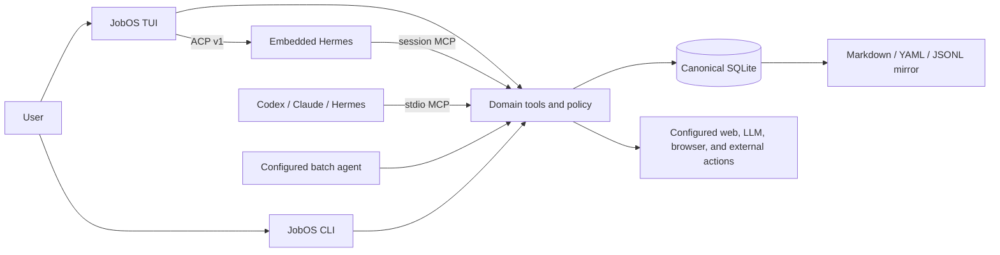

# JobOS

A local-first, agent-native operating system for job discovery, fit decisions, tailored materials, applications, networking, and follow-up.

<p align="center">
  
</p>

JobOS gives job seekers one terminal application backed by their own local data. The TUI combines a job pipeline, selected-job evidence, review queues, and a focused agent conversation without requiring a cloud account or API key.

## What you can do

- Build a reusable profile from a resume and verified proof points.
- Discover or import roles, then score fit with explicit evidence and gaps.
- Draft role-specific resumes, cover letters, research, and outreach.
- Review exact artifact revisions before they become application-ready.
- Track applications, interviews, contacts, tasks, and weekly progress.
- Use Hermes inside JobOS or connect Hermes, Codex, or Claude Code through MCP.
- Keep SQLite as the source of truth with readable Markdown, YAML, and JSONL mirrors.

## Install

Requires [Node.js 22 or newer](https://nodejs.org/).
> Release status: `jobos@0.1.0` is packaged and verified but has not been published to npm yet. The commands below are the post-publish install path; use the source checkout until the first release.

```bash
npm install --global jobos
jobos
```

Or download and open JobOS without a global install:

```bash
npx jobos
```

`jobos` is the primary human interface. On an empty workspace it opens guided setup automatically; on later runs it resumes the same local workspace.

<details>
<summary>Run from a source checkout</summary>

```bash
git clone https://github.com/lpbangun/JobOS.git
cd JobOS
npm install
npm link
jobos
```

</details>

## First run

The guided setup walks through the canonical local state in order:

1. Create a profile.
2. Import a resume.
3. Confirm at least one verifiable proof point.
4. Import or discover a job.
5. Record a pursue/hold decision.
6. Generate and review materials.

No provider, browser, or API key is required for this core flow.

Primary controls:

| Key | Action |
| --- | --- |
| `j` / `k` | Move through jobs or the active list |
| `Enter` | Open the selected action |
| `Tab` | Focus chat; press again to restore the dashboard |
| `i` | Type an agent prompt |
| `p` | Run the pursue workflow |
| `d` | Run discovery |
| `r` | Open review |
| `o` | Open documents |
| `g` | Resume guided setup |
| `?` | Show the complete contextual controls |
| `Q` | Quit cleanly |

Use optional mouse support to select visible job rows and focus chat from the agent pane or footer:

```bash
jobos --mouse
# or: export JOBOS_TUI_MOUSE=1
```

### Responsive behavior

- **Wide terminals:** dashboard by default; focused chat uses roughly 75–80% of the width and keeps selected-job context beside it.
- **Medium terminals:** panels stack without hiding the agent conversation.
- **Compact terminals:** `Tab` switches between a dashboard page and a full-width chat page instead of crushing three panes together.
- **Minimum:** `60×20`. Below that, JobOS shows one explicit resize message and does not mutate state.

## Connect your agent

JobOS has one domain layer and two agent entry paths. Both operate on the same workspace.

| Client | Embedded chat | External MCP | Batch workflows |
| --- | --- | --- | --- |
| Hermes | ACP v1 | Yes | Yes |
| Codex | Not currently | Yes | Yes |
| Claude Code | Not currently | Yes | No built-in batch manifest |

Connect an installed external client with one command:

```bash
jobos agents connect codex
jobos agents connect claude
jobos agents connect hermes
```

The command detects the executable, registers the installed JobOS MCP server with an argument array rather than a shell string, and verifies that the registration is visible. Preview without writing client configuration:

```bash
jobos agents connect codex --dry-run --json
```

Diagnose the complete path—Node, workspace permissions, CLI entrypoint, embedded ACP, external MCP, batch availability, and authentication evidence:

```bash
jobos agents doctor
jobos agents doctor hermes --json
```

### Embedded Hermes chat

Install and configure Hermes using the [official Hermes Agent instructions](https://github.com/NousResearch/hermes-agent), then run `jobos`. JobOS checks `hermes acp`, starts the ACP guest, and provides JobOS tools through a session-scoped MCP server. Provider credentials remain in Hermes configuration; JobOS does not copy them into the workspace mirror.

```bash
hermes setup
hermes acp --check
jobos
```

Press `Tab` for the expanded chat, `i` to compose, `↑`/`↓` or `j`/`k` for scrollback, and `Esc` to return to the dashboard.

## How it works



The important boundary: agents do not receive direct database authority. They call the same validated domain tools used by the TUI and CLI. Human-only review decisions stay mediated by trusted local input.

## Core workflow

Use the TUI for normal work. These CLI equivalents are useful for scripts and recovery:

```bash
# Inspect or resume guided setup.
jobos setup

# Import a job and run all saved discovery sources.
jobos jobs import-text --profile <profile-id> --file role.md
jobos daily --profile <profile-id> --json

# Inspect the whole workflow before running it.
jobos pursue <job-id> --profile <profile-id> --dry-run --json

# Run fit, research, materials, application preparation, and outreach planning.
jobos pursue <job-id> --profile <profile-id> --json

# Review every available command only when needed.
jobos help --all
```

Successful one-shot commands support `--json` where practical. Validation failures exit non-zero with a `jobos:` error and a typed JSON error under `--json`.

## Local data

By default, JobOS stores runtime state under the current directory:

```text
.jobos/jobos.sqlite              canonical database
jobos-workspace/profiles/*.yaml  agent-readable profile mirrors
jobos-workspace/jobs/*/          scores, research, artifacts, outreach
jobos-workspace/automations/     scheduler projections
jobos-workspace/audit.log.jsonl  local audit trail
```

Choose another workspace with either form:

```bash
jobos --workspace ~/career-data
export JOBOS_HOME=~/career-data
```

Runtime state is intentionally excluded from the package and repository. Back up `.jobos/` to preserve canonical state; mirrors can be regenerated.

## Safety defaults

- Local-first core: no telemetry, required cloud sync, or required provider key.
- SQLite is canonical; readable mirrors are projections, not a second writable database.
- Generated claims must trace to stored proof points or cited public sources.
- Resume and cover-letter artifacts default to `draft_needs_human_review`.
- Artifact approval, rejection, and other human-authority decisions require trusted TUI/CLI input.
- External actions are off by default and run only when the user explicitly configures and enables them.
- Restricted application answers remain redacted and are never silently reused.
- Browser sessions, provider credentials, and cookies are not written into agent-readable mirrors.

Authenticated job-board use is optional. Users are responsible for complying with third-party platform terms when enabling adapters or browser automation.

## Advanced configuration

- [Agent and MCP guide](docs/AGENT_GUIDE.md)
- [Optional providers, browser profiles, automation, and environment variables](docs/CONFIGURATION.md)
- [Application, MCP authority, Career Memory, and state contracts](docs/SAFETY_AND_STATE.md)
- [MCP compatibility decision](docs/mcp-compatibility-decision.md)

## Development

```bash
npm install
npm test
npm run smoke
```

The main runtime is Node.js ESM. Tests use Node's built-in test runner. `sql.js` provides the portable local SQLite database.

## Status

JobOS is an early local-first release. The deterministic pipeline, TUI, ACP/MCP paths, workspace mirrors, review gates, and core workflow are implemented. Optional websites and authenticated browser flows can change independently; JobOS reports those failures rather than fabricating success.

## License

[MIT](LICENSE)
