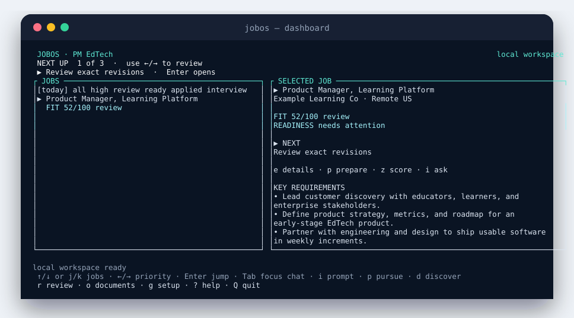
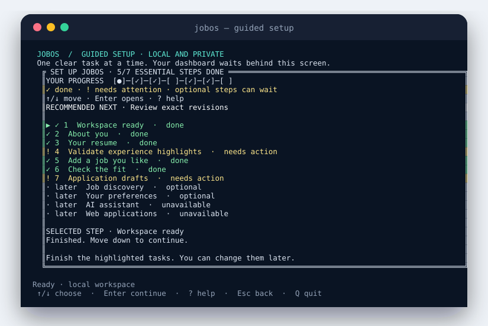
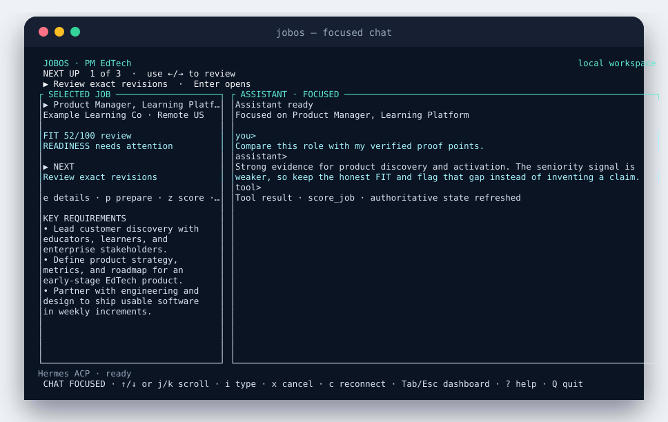
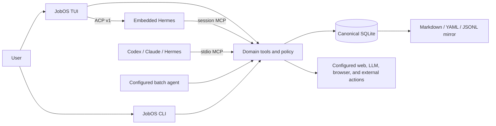

# JobOS

A local-first, agent-native operating system for job discovery, fit decisions, tailored materials, applications, networking, and follow-up.

<p align="center">
  
</p>

JobOS is a terminal application backed by your own local data. The TUI combines a job pipeline, selected-job evidence, review queues, guided setup, and a focused agent conversation—without a cloud account or required API key.

<p align="center">
  
  &nbsp;
  
</p>

## What you can do

- Build a reusable profile from a resume (paste or local PDF/DOCX/TXT/Markdown/JSON/YAML) and verified experience highlights.
- Discover or import roles, then score fit with explicit evidence, gaps, and unlock guidance when preferences are thin.
- Draft role-specific resumes, cover letters, research, and outreach from stored proof points—never invented claims.
- Review exact artifact revisions before they become application-ready; Enter jumps to the recommended next task.
- Track applications, interviews, contacts, tasks, and weekly progress.
- Use Hermes inside JobOS (ACP) or connect Hermes, Codex, or Claude Code through MCP.
- Keep SQLite as the source of truth with readable Markdown, YAML, and JSONL mirrors.

## Install

Requires [Node.js 22 or newer](https://nodejs.org/).
> Release status: `jobos@0.1.0` is packaged and verified but has not been published to npm yet. The commands below are the post-publish install path; use the source checkout until the first release.

```bash
npm install --global jobos
jobos
```

Or download and open JobOS without a global install:

```bash
npx jobos
```

`jobos` is the primary human interface. On an empty workspace it opens guided setup automatically; on later runs it resumes the same local workspace.

<details>
<summary>Run from a source checkout</summary>

```bash
git clone https://github.com/lpbangun/JobOS.git
cd JobOS
npm install
npm link
jobos
```

</details>

## First run

Guided setup opens as a focused full-screen workspace and starts on the first task that needs action:

1. Confirm the local workspace.
2. Create or choose a profile.
3. Add a resume by pasting text or choosing a local PDF, DOCX, TXT, Markdown, JSON, or YAML file; review and correct the extracted identity fields before import. Image-only PDFs need local OCR first.
4. Validate, edit, reject, or add the experience highlights extracted from the resume. `Enter` validates the selected highlight, moves to the next one, and continues automatically after the final required validation.
5. Add a job you like or would seriously consider by pasting a description or URL, browsing a local file, entering a path, or configuring company-page discovery. This first role helps JobOS understand the roles, companies, and work you prefer; it does not apply for you.
6. Check the fit and choose whether to pursue the job.
7. Generate and review application materials.

Optional later steps cover discovery sources, preference calibration (roles, location/work model, compensation, mission), the AI assistant, and web applications. Successful actions move directly to the next task. Press `g` later to return to setup.

Use `↑`/`↓` on setup and other selectable lists; `j`/`k` remain optional alternatives. `Tab`/`Shift+Tab` also move within setup, and `1`–`7` jumps to an essential step. `Enter` opens the selected action, `c` changes completed information, `r` refreshes the setup view, and `Esc` returns to the dashboard. In the document viewer, the document names form a vertical list: `↑`/`↓` or `j`/`k` changes documents, while `PgUp`/`PgDn` scrolls the open document.

Every text field supports `Left`/`Right`, `Home`/`End`, `Backspace`, `Delete`, and `Shift`+arrow selection. Pasted text is inserted at the cursor and replaces the current selection. Press `?` for controls and the recommended action on the current screen; press `?` again for the complete shortcut reference.

Resume extraction stays local. JobOS preserves an imported PDF or DOCX under private `.jobos/` state, stores the reviewed structured revision in SQLite, and writes readable `current.md`, `current-source.md`, and YAML projections under `jobos-workspace/profiles/<profile-id>/resume/`. The Markdown files are projections; use JobOS to make reviewed changes so revision history remains intact.

Primary controls:

| Key | Action |
| --- | --- |
| `↑` / `↓` or `j` / `k` | Move through jobs or the active list |
| `←` / `→` | Cycle the priority strip |
| `Enter` | Open the selected / recommended action |
| `Tab` | Focus chat; press again to restore the dashboard |
| `i` | Type an agent prompt |
| `p` | Run the pursue workflow |
| `d` | Run discovery |
| `r` | Open review |
| `o` | Open documents |
| `n` / `b` | Network paths / build network map |
| `g` | Resume guided setup |
| `?` | Show contextual help; press again for all shortcuts |
| `Q` | Quit cleanly |

Use optional mouse support to select visible jobs, filters, setup choices, and overlay rows, or to focus chat from the agent pane or footer:

```bash
jobos --mouse
# or: export JOBOS_TUI_MOUSE=1
```

### Responsive behavior

- **Wide terminals:** dashboard by default; focused chat uses roughly 75–80% of the width and keeps selected-job context beside it.
- **Medium terminals:** panels stack without hiding the agent conversation.
- **Compact terminals:** `Tab` switches between a dashboard page and a full-width chat page instead of crushing three panes together.
- **Minimum:** `60×20`. Below that, JobOS shows one explicit resize message and does not mutate state.

## Connect your agent

JobOS has one domain layer and two agent entry paths. Both operate on the same workspace.

| Client | Embedded chat | External MCP | Batch workflows |
| --- | --- | --- | --- |
| Hermes | ACP v1 (default TUI guest) | Yes | Yes |
| Oh My Pi (`omp`) | ACP v1 (alternate; `JOBOS_ACP_COMMAND=omp`) | Yes (`.omp/mcp.json`) | No |
| Codex | Not currently | Yes | Yes |
| Claude Code | Not currently | Yes | No built-in batch manifest |
| Grok Build | Not currently | Yes | No |
| Cursor CLI (`agent`) | Not currently | Yes (`.cursor/mcp.json`) | No |

Connect an installed external client with one command:

```bash
jobos agents connect codex
jobos agents connect claude
jobos agents connect hermes
jobos agents connect grok
jobos agents connect cursor
jobos agents connect pi
```

The command detects the executable, registers the installed JobOS MCP server with an argument array rather than a shell string, and verifies that the registration is visible. Preview without writing client configuration:

```bash
jobos agents connect codex --dry-run --json
```

Diagnose the complete path—Node, workspace permissions, CLI entrypoint, embedded ACP, external MCP, batch availability, and authentication evidence:

```bash
jobos agents doctor
jobos agents doctor hermes --json
```

### Claude Code and Codex (career-ops-style)

Like career-ops, JobOS ships CLI entry wrappers and a shared skill so you can drive the product from the agent you already use:

| CLI | Entry | Skill | Typical invoke |
| --- | --- | --- | --- |
| Claude Code | `CLAUDE.md` | `.claude/skills/jobos` → `.agents/skills/jobos` | `claude` then `/jobos`, or `claude -p "…"` |
| Codex | `CODEX.md` | same skill + plain-language modes | `codex`, or `codex exec "…"` |

```bash
jobos agents connect claude
claude
# /jobos daily   or: score this JD with JobOS

jobos agents connect codex
codex
# Ask: Run JobOS daily discovery and summarize new roles
```

Guides: [docs/CLAUDE.md](docs/CLAUDE.md), [docs/CODEX.md](docs/CODEX.md).

### Embedded Hermes chat

Install and configure Hermes using the [official Hermes Agent instructions](https://github.com/NousResearch/hermes-agent), then run `jobos`. JobOS checks `hermes acp`, starts the ACP guest, and provides JobOS tools through a session-scoped MCP server. Provider credentials remain in Hermes configuration; JobOS does not copy them into the workspace mirror.

```bash
hermes setup
hermes acp --check
jobos
```

Press `Tab` for the expanded chat, `i` to compose, `↑`/`↓` or `j`/`k` for scrollback, and `Esc` to return to the dashboard. Each turn receives bounded JobOS context for the active profile and selected job, including a secret-safe summary of the current resume upload and verified experience highlights. Raw resume text and contact details are excluded from this host context; Hermes can use the mediated JobOS tools for current domain state.

In chat command mode (`:`), `:resume` lists persisted Hermes ACP sessions for the workspace; `:resume <profile-id>` reconnects the agent pane to that profile's saved session.

## How it works



The important boundary: agents do not receive direct database authority. They call the same validated domain tools used by the TUI and CLI. Human-only review decisions stay mediated by trusted local input.

## Core workflow

Use the TUI for normal work. These CLI equivalents are useful for scripts and recovery:

```bash
# Inspect or resume guided setup.
jobos setup

# Import a job and run all saved discovery sources.
jobos jobs import-text --profile <profile-id> --file role.md
jobos daily --profile <profile-id> --json

# Inspect the whole workflow before running it.
jobos pursue <job-id> --profile <profile-id> --dry-run --json

# Run fit, research, materials, application preparation, and outreach planning.
jobos pursue <job-id> --profile <profile-id> --json

# Review every available command only when needed.
jobos help --all
```

Successful one-shot commands support `--json` where practical. Validation failures exit non-zero with a `jobos:` error and a typed JSON error under `--json`.

## Local data

By default, JobOS stores runtime state under the current directory:

```text
.jobos/jobos.sqlite              canonical database
jobos-workspace/profiles/*.yaml  agent-readable profile mirrors
jobos-workspace/jobs/*/          scores, research, artifacts, outreach
jobos-workspace/automations/     scheduler projections
jobos-workspace/audit.log.jsonl  local audit trail
```

Choose another workspace with either form:

```bash
jobos --workspace ~/career-data
export JOBOS_HOME=~/career-data
```

Runtime state is intentionally excluded from the package and repository. Back up `.jobos/` to preserve canonical state; mirrors can be regenerated.

## Safety defaults

- Local-first core: no telemetry, required cloud sync, or required provider key.
- SQLite is canonical; readable mirrors are projections, not a second writable database.
- Generated claims must trace to stored proof points or cited public sources.
- Resume and cover-letter artifacts default to `draft_needs_human_review`.
- Artifact approval, rejection, and other human-authority decisions require trusted TUI/CLI input.
- External actions are off by default and run only when the user explicitly configures and enables them.
- Restricted application answers remain redacted and are never silently reused.
- Browser sessions, provider credentials, and cookies are not written into agent-readable mirrors.

Authenticated job-board use is optional. Users are responsible for complying with third-party platform terms when enabling adapters or browser automation.

## Advanced configuration

- [Agent and MCP guide](docs/AGENT_GUIDE.md)
- [Optional providers, browser profiles, automation, and environment variables](docs/CONFIGURATION.md)
- [Application, MCP authority, Career Memory, and state contracts](docs/SAFETY_AND_STATE.md)
- [MCP compatibility decision](docs/mcp-compatibility-decision.md)

## Development

```bash
npm install
npm test
npm run smoke
```

The main runtime is Node.js ESM. Tests use Node's built-in test runner. `sql.js` provides the portable local SQLite database.

Deterministic noninteractive TUI frames (useful for docs and debugging):

```bash
jobos tui --snapshot --width 120 --height 36
```

## Status

JobOS is an early local-first release. The deterministic pipeline, responsive TUI, guided setup, ACP/MCP paths, workspace mirrors, review gates, and core pursue workflow are implemented. Recent product surfaces include honest FIT/unlock guidance, exact material review as the primary next action when drafts exist, resume identity correction, document-viewer navigation, and Hermes session resume via `:resume`. Optional websites and authenticated browser flows can change independently; JobOS reports those failures rather than fabricating success.

## License

[MIT](LICENSE)
