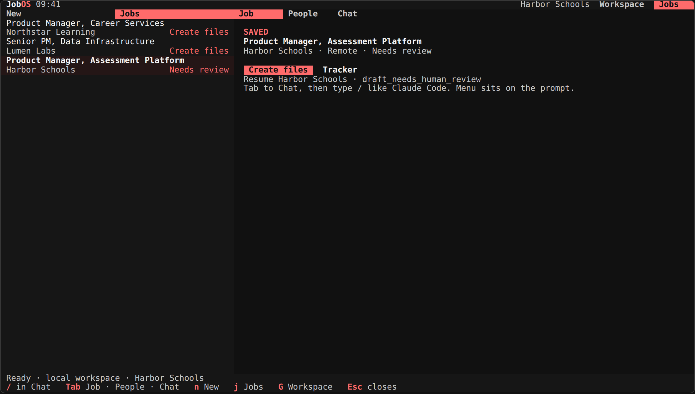
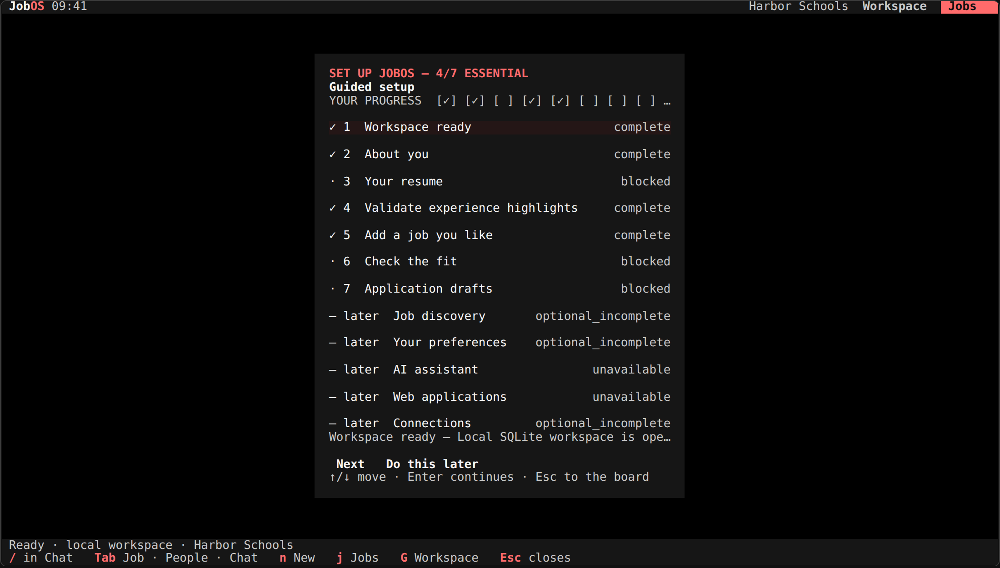
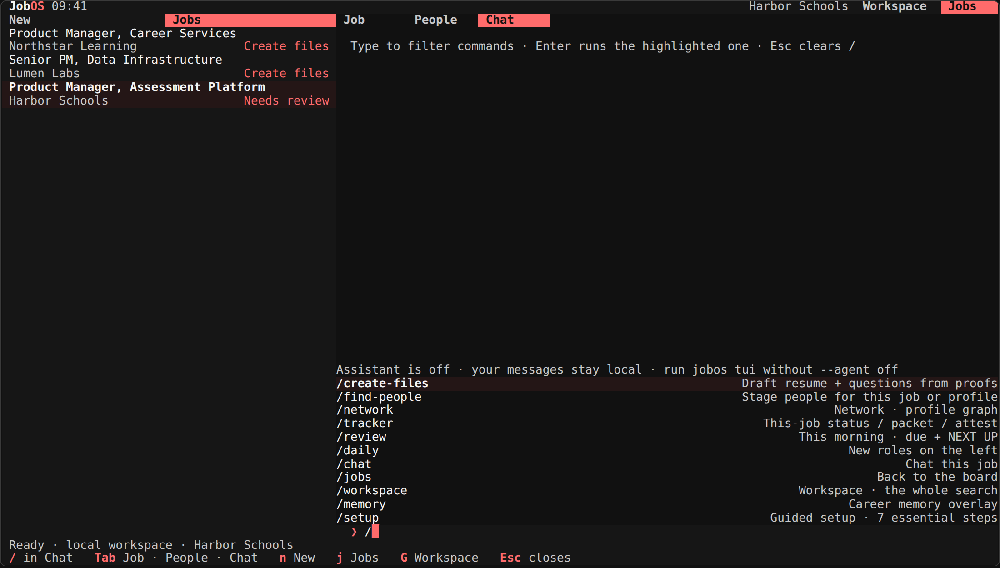
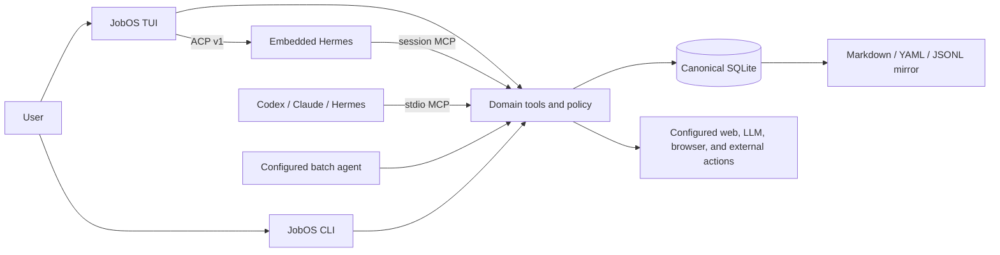

# JobOS

A local-first, agent-native operating system for job discovery, fit decisions, tailored materials, applications, networking, and follow-up.

<p align="center">
  
</p>

JobOS is a terminal application backed by your own local data. The TUI is a keyboard-first Classic-red Ink app: a header mode bar (`Workspace` and `Jobs`), a `New | Jobs` pipeline rail with action chips (`Needs review`, `Create files`, `Find people`, `Due follow-up`), a `Job | People | Chat` detail pane, slash commands in the prompt, and a covering overlay family for setup, files, tracker, review, people, network, and memory—with no cloud account or required API key.

<p align="center">
  
  &nbsp;
  
</p>

## What you can do

- Build a reusable profile from a resume (paste or local PDF/DOCX/TXT/Markdown/JSON/YAML) and verified experience highlights.
- Discover or import roles, then score fit with explicit evidence, gaps, and unlock guidance when preferences are thin.
- Draft role-specific resumes, cover letters, research, and outreach from stored proof points—never invented claims.
- Review exact artifact revisions before they become application-ready: the Files overlay shows `resume.md` + `questions.md` with Approve / Reject, and `Enter` on a rail row opens its tracker.
- Track applications, interviews, contacts, tasks, and weekly progress.
- Drive the board with keyboard-first chrome: `n` / `j` switch the `New | Jobs` rail, `Tab` / `Shift+Tab` cycle the `Job | People | Chat` pane, `/` opens slash commands in the prompt, and `g` toggles Workspace and Jobs. Mouse clicks route to the same surfaces on real terminals.
- Use Hermes inside JobOS (ACP) or connect Hermes, Codex, or Claude Code through MCP.
- Keep SQLite as the source of truth with readable Markdown, YAML, and JSONL mirrors.

## Install

Requires [Node.js 22 or newer](https://nodejs.org/).
> Release status: `jobos@0.1.0` is packaged and verified but has not been published to npm yet. The commands below are the post-publish install path; use the source checkout until the first release.

```bash
npm install --global jobos
jobos
```

Or download and open JobOS without a global install:

```bash
npx jobos
```

`jobos` is the primary human interface. On an empty workspace it opens guided setup automatically; on later runs it resumes the same local workspace.

<details>
<summary>Run from a source checkout</summary>

```bash
git clone https://github.com/lpbangun/JobOS.git
cd JobOS
npm install
npm link
jobos
```

</details>

## First run

Guided setup opens as a focused full-screen workspace and starts on the first task that needs action:

1. Confirm the local workspace.
2. Create or choose a profile.
3. Add a resume by pasting text or choosing a local PDF, DOCX, TXT, Markdown, JSON, or YAML file; review and correct the extracted identity fields before import. Image-only PDFs need local OCR first.
4. Validate, edit, reject, or add the experience highlights extracted from the resume. `Enter` validates the selected highlight, moves to the next one, and continues automatically after the final required validation.
5. Add a job you like or would seriously consider by pasting a description or URL, browsing a local file, entering a path, or configuring company-page discovery. This first role helps JobOS understand the roles, companies, and work you prefer; it does not apply for you.
6. Check the fit and choose whether to pursue the job.
7. Generate and review application materials.

Optional later steps cover discovery sources, preference calibration (roles, location/work model, compensation, mission), the AI assistant, and web applications. Successful actions move directly to the next task. Press `/` and pick `/setup` later to return to guided setup.

Setup is a covering overlay: `↑` / `↓` move between steps, `Enter` continues the selected step, and `Esc` returns to the board. The progress list shows real state (complete / blocked / later), and the nested pickers—resume source, experience-highlight review, job source—call the same domain actions as the rest of the app, so nothing on screen is a fake checklist.

Text fields support `Left` / `Right` and `Backspace` cursor editing; pasted text is inserted at the cursor. The footer always shows the shortcuts available on the current screen (for example `/ in Chat · Tab Job · People · Chat · n New · j Jobs · G Workspace · Esc closes`), so there is no separate help-mode key to discover.

Resume extraction stays local. JobOS preserves an imported PDF or DOCX under private `.jobos/` state, stores the reviewed structured revision in SQLite, and writes readable `current.md`, `current-source.md`, and YAML projections under `jobos-workspace/profiles/<profile-id>/resume/`. The Markdown files are projections; use JobOS to make reviewed changes so revision history remains intact.

Primary controls:

| Key | Action |
| --- | --- |
| `↑` / `↓` | Move through rail rows or the active overlay list |
| `Enter` | Open the selected / recommended action (or continue setup) |
| `Tab` / `Shift+Tab` | Cycle the detail pane: Job → People → Chat |
| `n` / `j` | Switch the left rail: New (daily) / Jobs (pipeline) |
| `g` | Toggle Workspace (whole-search chat) and Jobs (board) |
| `/` | Open the slash menu in the prompt; type to filter, `↑`/`↓` + `Enter` to run |
| `Esc` | Close the overlay / clear `/` |
| `q` | Quit cleanly |

Slash commands run in the prompt: `/create-files`, `/find-people`, `/network`, `/tracker`, `/review`, `/daily`, `/chat`, `/jobs`, `/workspace`, `/memory`, `/setup`. A bare `Enter` on a just-typed `/` never runs a command you did not select; it clears the prompt instead.

Overlays add their own keys, shown in the footer of each surface:

| Overlay | Keys |
| --- | --- |
| Files (`/create-files`) | `a` approve · `r` reject with a reason |
| Tracker (`/tracker`) | `1`–`4` saved / researching / applied / waiting · `f` freeze packet · `t` attest submission |
| Morning brief (`/review`) | `w` run this week's review |
| Keep/skip people (`/find-people`) | `k` keep · `x` skip |
| Network (`/network`) | `i` edit intent · `g` refresh the graph |
| Connection | `d` draft outreach · `a` approve contact · `r` record contact · `s` mark sent |
| Career memory (`/memory`) | `a` accept · `r` reject · `v` revoke |

On a real terminal, SGR mouse support is on automatically (snapshot and CI output stay byte-clean). Click header modes, rail segments and rows, the `Job | People | Chat` tabs, overlay rows, and the composer send target; pointer bytes never leak into the prompt. Keyboard stays the primary path.

### Responsive behavior

The shell fills the terminal you give it: live runs use the full stdout width and height and reflow on resize, and `--width` / `--height` override it for scripting and snapshots (default `140×42`).

- The board splits into a left rail and a `Job | People | Chat` detail pane whenever there is room (width ≥ 46 and height ≥ 6); the rail takes about a third, and the pane tabs keep fixed, compact spacing instead of stretching across the pane.
- Narrow or very short terminals fall back to a compact board (full-width rail) rather than crushing the pane tabs beside the rail.
- Overlays (welcome, setup, files, tracker, review, keep/skip people, network, connection, memory) cover the whole frame, hide the rail and pane tabs, and dim the shell behind them.

## Connect your agent

JobOS has one domain layer and two agent entry paths. Both operate on the same workspace.

| Client | Embedded chat | External MCP | Batch workflows |
| --- | --- | --- | --- |
| Hermes | ACP v1 (default TUI guest) | Yes | Yes |
| Oh My Pi (`omp`) | ACP v1 (alternate; `JOBOS_ACP_COMMAND=omp`) | Yes (`.omp/mcp.json`) | No |
| Codex | Not currently | Yes | Yes |
| Claude Code | Not currently | Yes | No built-in batch manifest |
| Grok Build | Not currently | Yes | No |
| Cursor CLI (`agent`) | Not currently | Yes (`.cursor/mcp.json`) | No |

Connect an installed external client with one command:

```bash
jobos agents connect codex
jobos agents connect claude
jobos agents connect hermes
jobos agents connect grok
jobos agents connect cursor
jobos agents connect pi
```

The command detects the executable, registers the installed JobOS MCP server with an argument array rather than a shell string, and verifies that the registration is visible. Preview without writing client configuration:

```bash
jobos agents connect codex --dry-run --json
```

Diagnose the complete path—Node, workspace permissions, CLI entrypoint, embedded ACP, external MCP, batch availability, and authentication evidence:

```bash
jobos agents doctor
jobos agents doctor hermes --json
```

### Claude Code and Codex (career-ops-style)

Like career-ops, JobOS ships CLI entry wrappers and a shared skill so you can drive the product from the agent you already use:

| CLI | Entry | Skill | Typical invoke |
| --- | --- | --- | --- |
| Claude Code | `CLAUDE.md` | `.claude/skills/jobos` → `.agents/skills/jobos` | `claude` then `/jobos`, or `claude -p "…"` |
| Codex | `CODEX.md` | same skill + plain-language modes | `codex`, or `codex exec "…"` |

```bash
jobos agents connect claude
claude
# /jobos daily   or: score this JD with JobOS

jobos agents connect codex
codex
# Ask: Run JobOS daily discovery and summarize new roles
```

Guides: [docs/CLAUDE.md](docs/CLAUDE.md), [docs/CODEX.md](docs/CODEX.md).

### Embedded Hermes chat

Install and configure Hermes using the [official Hermes Agent instructions](https://github.com/NousResearch/hermes-agent), then run `jobos`. JobOS checks `hermes acp`, starts the ACP guest, and provides JobOS tools through a session-scoped MCP server. Provider credentials remain in Hermes configuration; JobOS does not copy them into the workspace mirror.

```bash
hermes setup
hermes acp --check
jobos
```

Press `/` and choose `/chat` (or `Tab` to the Chat pane) to compose; `Esc` clears the prompt and returns to the board. Each turn receives bounded JobOS context for the active profile and selected job, including a secret-safe summary of the current resume upload and verified experience highlights. Raw resume text and contact details are excluded from this host context; Hermes can use the mediated JobOS tools for current domain state.

While a prompt is working, `Esc` cancels the turn in place and quarantines the cancelled session. Hermes ACP sessions persist under `.jobos/acp-sessions.json`, and the next launch resumes the saved session automatically, so conversation context survives restarts.

## How it works



The important boundary: agents do not receive direct database authority. They call the same validated domain tools used by the TUI and CLI. Human-only review decisions stay mediated by trusted local input.

## Core workflow

Use the TUI for normal work. These CLI equivalents are useful for scripts and recovery:

```bash
# Inspect or resume guided setup.
jobos setup

# Import a job and run all saved discovery sources.
jobos jobs import-text --profile <profile-id> --file role.md
jobos daily --profile <profile-id> --json

# Inspect the whole workflow before running it.
jobos pursue <job-id> --profile <profile-id> --dry-run --json

# Run fit, research, materials, application preparation, and outreach planning.
jobos pursue <job-id> --profile <profile-id> --json

# Resolve one person by an exact email and reveal their trusted local contacts.
jobos people find --email <addr> --json
jobos contacts show --email <addr> --json

# Start person research from an email; Exa people is optional and key-gated.
jobos research people --profile <profile-id> --scope person --email <addr> --sources exa_people --json

# Inspect profile-level direct/indirect opportunities, two-hop paths, and warmth.
jobos network opportunities --profile <profile-id> --json
jobos network graph --profile <profile-id> --max-hops 2 --json
jobos network health --profile <profile-id> --json

# Record contact recency through trusted human CLI input only.
jobos network record --profile <profile-id> --person <person-id> --json

# Review every available command only when needed.
jobos help --all
```

Successful one-shot commands support `--json` where practical. Validation failures exit non-zero with a `jobos:` error and a typed JSON error under `--json`.

## Local data

By default, JobOS stores runtime state under the current directory:

```text
.jobos/jobos.sqlite              canonical database
.jobos/acp-sessions.json         persisted Hermes ACP session ids (resume across launches)
jobos-workspace/profiles/*/      profile, network health, opportunity, and graph mirrors
jobos-workspace/jobs/*/          scores, research, artifacts, outreach
jobos-workspace/automations/     scheduler projections
jobos-workspace/audit.log.jsonl  local audit trail

```

Agent-readable mirrors redact contact values and expose only contact counts, types, and evidence tiers. Full values remain in the canonical local database and are revealed only by trusted CLI/TUI contact surfaces.

Choose another workspace with either form:

```bash
jobos --workspace ~/career-data
export JOBOS_HOME=~/career-data
```

Runtime state is intentionally excluded from the package and repository. Back up `.jobos/` to preserve canonical state; mirrors can be regenerated.

## Safety defaults

- Local-first core: no telemetry, required cloud sync, or required provider key.
- SQLite is canonical; readable mirrors are projections, not a second writable database.
- Generated claims must trace to stored proof points or cited public sources.
- Resume and cover-letter artifacts default to `draft_needs_human_review`.
- Artifact approval, rejection, and other human-authority decisions require trusted TUI/CLI input.
- External actions are off by default and run only when the user explicitly configures and enables them.
- Restricted application answers remain redacted and are never silently reused.
- Browser sessions, provider credentials, and cookies are not written into agent-readable mirrors.

Authenticated job-board use is optional. Users are responsible for complying with third-party platform terms when enabling adapters or browser automation.

## Advanced configuration

- [Agent and MCP guide](docs/AGENT_GUIDE.md)
- [Optional providers, browser profiles, automation, and environment variables](docs/CONFIGURATION.md)
- [Application, MCP authority, Career Memory, and state contracts](docs/SAFETY_AND_STATE.md)
- [MCP compatibility decision](docs/mcp-compatibility-decision.md)

## Development

```bash
npm install
npm test
npm run smoke
```

The main runtime is Node.js ESM. Tests use Node's built-in test runner. `sql.js` provides the portable local SQLite database.

Deterministic noninteractive TUI frames (useful for docs and debugging):

```bash
jobos tui --snapshot --width 120 --height 36
```

Regenerate the README screenshots from real TUI frames:

```bash
FORCE_COLOR=3 node scripts/readme-shots.mjs
# writes docs/jobos-tui.png, docs/jobos-chat.png, docs/jobos-setup.png
```

## Status

JobOS is an early local-first release. The deterministic pipeline, guided setup, ACP/MCP paths, workspace mirrors, review gates, and core pursue workflow are implemented. The TUI is a Classic-red Ink app rebuilt around the locked information architecture: a `Workspace | Jobs` header, a `New | Jobs` rail with action chips, a `Job | People | Chat` detail pane, slash commands in the prompt, a covering overlay family, automatic SGR mouse support, and live ACP sessions with in-pane cancel and cross-launch resume. The shell fills any terminal (falling back to compact chrome on narrow frames), and `--snapshot` stays deterministic for docs and CI. Optional websites and authenticated browser flows can change independently; JobOS reports those failures rather than fabricating success.

## License

[MIT](LICENSE)
