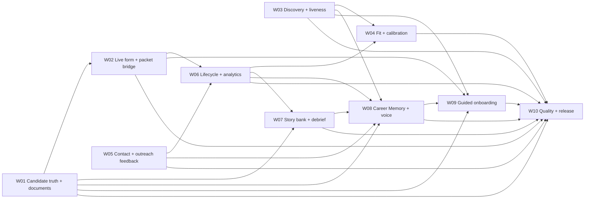

# JobOS Capability Parity Master Plan

**Plan date:** 2026-07-22  
**Source audits:** `CAREER_OPS_IMPLEMENTATION_AUDIT.md` and `docs/open_source_benchmark_checkup.md`  
**Supporting product evidence:** `Gap_Analysis_and_Benchmark.md`, `ideal-agent-native-job-application-app.md`, and `Feature_Adaptation_Plan.md`  
**Canonical execution board:** `docs/JOBOS_WORKTREE_EXECUTION_BOARD.md`  
**Purpose:** Give every feature worktree the same product-level target, dependency order, scope boundaries, and acceptance bar.

## 1. Master conclusion

JobOS is already strongest where trust, provenance, and user control matter: local canonical state, artifact lineage, immutable packets, sensitive-answer policy, executable research, and mediated side effects. It is not yet first-class at the two deliverables that leave the control plane:

1. a complete, submission-ready, proof-grounded application document;
2. an application workflow grounded in the employer's real form.

The roadmap therefore deepens the existing journey instead of expanding the command list. The intended product is not a scraper farm, bulk auto-applier, sales sequencer, generic browser agent, or template marketplace.

An additional evaluated gap is worth adding: JobOS has durable facts and outcomes but no explicit mechanism for turning user decisions and edits into reversible guidance. A local **Career Memory** layer is a strong P1 multiplier after the P0 document and live-form contracts—not a reason to delay those contracts.

## 2. Product target

A first-class JobOS journey must let a job seeker:

1. maintain a complete, correctable candidate record with durable proof lineage;
2. discover active roles while preserving source-native decision data and honest partial failures;
3. make reproducible pursue decisions with explicit uncertainty and legitimacy separated from fit;
4. research people and warm paths with inspectable confidence, freshness, and consent;
5. record why jobs and drafts were saved, skipped, approved, rejected, or edited, then accept or reject attributable preference proposals;
6. maintain a compact, human-readable career brief and voice/positioning guide built only from canonical facts and accepted guidance;
7. generate a normal, complete resume and usable cover letter whose changed claims trace to evidence;
8. inspect the employer's actual form, resolve its real fields, safely fill it from an exact approved packet, and verify what was filled;
9. turn submission, replies, interviews, and outcomes into dated next actions and better later decisions.

## 3. Protected advantages — preserve, integrate, do not rebuild

Every worktree must preserve these existing JobOS strengths:

- SQLite canonical state, relational invariants, locking, atomic persistence, and workspace mirrors;
- proof IDs, source/evidence references, artifact hashes, revision lineage, diffs, and exact-revision approval;
- immutable application packets, staleness/currency checks, human submission attestation, idempotency, and receipt confirmation;
- sensitive-answer classification, restricted categories, redaction, reuse scope, employer scope, and `never_auto_fill`;
- bounded and resumable research runs, source observations, identity resolution, contact approval/suppression, and warm-path ranking;
- MCP/ACP/domain-tool mediation, secret redaction, browser script hash pinning, and explicit side-effect gates;
- public-ATS-first discovery with redirect/request budgets, URL credential rejection, DNS resolution, and SSRF controls;
- local-first operation with no required cloud service, telemetry, or API key for the core flow.

Parity work may connect these systems. It must not replace them with prompt-only behavior, Markdown as canonical state, sensitive plaintext snapshots, untracked browser actions, silent profile mutation, or model interpretation presented as user truth.

## 4. Consolidated capability baseline

Scores are from the Career Ops audit where available. Maturity verdicts incorporate the broader open-source checkup.

| Journey capability | JobOS / Career Ops | Consolidated JobOS verdict | Material gap | Best transferable benchmark lesson | Work bundle |
|---|---:|---|---|---|---|
| Profile and proof foundation | — | Foundational | Regex-led resume import can omit sections; proofs lack complete correct/merge/retire/verify lifecycle | RenderCV validated structure; Resume Matcher complete editable source resume | W01 |
| Discovery and source coverage | 3.0 / 4.5 | Competitive with gaps | No retry/backoff, honest partial run, per-job isolation, rich normalized fields, or decision filters | JobSpy normalization, throttling, filters, and partial results; retain JobOS network safeguards | W03 |
| Posting liveness and legitimacy | 1.5 / 4.5 | Foundational | No pre-score/pursuit active-expired-uncertain gate | Career Ops liveness ladder, redirects, closure text, apply controls, anti-bot uncertainty | W03 |
| Fit evaluation | 3.0 / 4.0 | Competitive with correctness gaps | Overall can disagree with displayed dimensions; unknowns, dealbreakers, evidence references, and outcome calibration are weak | Career Ops report consistency and golden cases; do not copy its archetype-only release gate | W04 |
| People, contacts, and warm paths | 4.5 / 2.5 | First-class orchestration; competitive contact quality | Public observation, company-domain relevance, freshness, DNS, SMTP, and catch-all confidence are conflated | Tighten existing evidence tiers; Sherlock/theHarvester are negative-scope comparators | W05 |
| Outreach | 4.5 / 3.0 | Competitive | Deterministic ask is weakly stakeholder-aware; reply/meeting/no-response outcomes do not improve later choices | Preserve proof/source allowlists; add role-aware asks and lightweight outcomes, not sales automation | W05 |
| Resume and cover-letter output | 1.5 / 4.5 | Foundational outcome; first-class governance | Current outputs are evidence worksheets, not complete application documents; no production renderer or semantic completeness gate | Resume Matcher full-resume flow; RenderCV validated structure and Typst/PDF; Career Ops render/page/fact checks | W01 |
| Readiness, answers, packet, receipt | 5.0 / 3.0 for tracking/provenance | First-class around the form | Current readiness relies on synthetic likely questions and can overclaim application readiness | Keep governance; rename pre-form state and bind final readiness to a live form fingerprint | W02 |
| Application-form assistance | 2.0 / 4.5 | Foundational | Browser primitives are not a cohesive extraction → answer → fill → read-back → handoff workflow | Career Ops live form extraction/filling; narrow packet-bound adapter rather than AIHawk/browser-use breadth | W02 |
| Application lifecycle and analytics | — | Competitive with gaps | Generic stale next action, unscoped weekly tasks, no employer follow-up cadence, stage velocity, or calibrated feedback | Career Ops idempotent follow-up cadence and status-ledger velocity | W06 |
| Interview preparation | 2.5 / 4.0 | Foundational-to-competitive | Generated prompts are not a persistent verified story bank; no debrief loop | Career Ops audience packs and zero-LLM story matching; persist stories as JobOS domain records | W07 |
| Career memory, preference learning, and writing voice | — / not scored | Absent | No structured save/skip reasons, reusable writing-feedback taxonomy, accepted preference proposals, synthesized career brief, or feedback-driven voice guide | Use local attributed events plus visible accept/reject/revoke proposals; never invisible fine-tuning or automatic canonical mutation | W08 |
| Onboarding and product UX | 3.0 / 4.5 | Operator-oriented | Setup expects command, ID, preference, and source knowledge | Guided completion through existing TUI and agent infrastructure, not another dashboard | W09 |
| Agent/tool integration | 4.5 / 4.0 | Strong supporting infrastructure | MCP is narrow, handwritten, and pinned to protocol `2024-11-05` | Current MCP SDK is a maintenance option, not a product milestone | W10 |
| Test, security, release, docs | 3.5 / 4.5 | Functional but behind | Golden behavioral coverage, security/dependency/data-leak checks, release discipline, and documentation consistency lag | Career Ops release hygiene, strengthened to gate observable JobOS contracts | W10 |

## 5. Benchmark lessons and corrections retained in this plan

### Adopt

- **Career Ops:** complete document semantics, rendered-page verification, live form inspection, liveness classification, interview audience packs/story matching, follow-up cadence, stage velocity, guided setup, and release hygiene.
- **RenderCV:** validated canonical resume data and one disciplined render handoff.
- **Resume Matcher:** complete editable source resume, grounded ATS/requirement coverage, and export without reconstructing content.
- **JobSpy:** richer normalized job fields, filters, bounded retry/backoff, throttling, and partial-result behavior.
- **Current MCP reference servers:** SDK-managed protocol negotiation and typed schemas when protocol maintenance becomes a real cost.

### Do not over-credit or copy

- Sherlock does username-site probing; it is not an email discovery or verification model.
- theHarvester aggregates public addresses and infrastructure; it does not prove recipient mailboxes or warm paths.
- SalesGPT is a sales conversation/sending system, not a job-seeker outreach standard.
- Awesome-CV is a manual LaTeX presentation template, not a truth or tailoring pipeline.
- AIHawk and browser-use demonstrate automation breadth but not JobOS-grade sensitivity, packet binding, idempotency, account safety, or receipt evidence.
- Career Ops often encodes behavior in prompts, uses weaker canonical persistence, exposes plaintext answer snapshots, and gates golden evaluation too narrowly. Adopt semantic depth, not those weaknesses.

### Evaluated addition — Career Memory

**Decision: add as a P1 bundle.** The gap is real and the proposed product shape fits JobOS better than model fine-tuning.

Current implementation evidence supports the diagnosis:

- `profiles.preferences_json` stores explicit settings, but `communicationStyle` is a manually configured string rather than learned guidance;
- score and generation paths read the current profile and proofs directly; there is no compact, maintained career brief;
- artifact approval/rejection stores an attributable review note and audit event, but later generators do not retrieve structured feedback rules;
- artifact revision lineage and diffs provide strong raw material for learning, while the current cover-letter renderer intentionally discards model prose to preserve truthfulness;
- `Gap_Analysis_and_Benchmark.md` scores the feedback-learning loop at zero, and the ideal architecture plus adaptation plan already specify calibration, explicit events, visible proposals, accept/reject, undo, and held-out evaluation.

The safe architecture has three separate layers:

1. **Canonical memory:** existing user-controlled profile facts, constraints, proofs, answers, and explicit communication/positioning preferences. Do not duplicate these into a second truth store.
2. **Observational memory:** profile-scoped append-only facts such as save/skip/apply reasons, artifact approve/reject/edit feedback, revision diffs, outreach/interview/application outcomes, source IDs, actor, and time.
3. **Derived memory:** cited proposals for search, selection, framing, tone, length, vocabulary, and positioning. Proposals have confidence and lifecycle state; only explicitly accepted, active rules may influence behavior.

The synthesized career brief and voice/positioning guide are versioned projections, not new canonical truth. They must show their source facts and accepted rule IDs, remain human-editable, and regenerate deterministically. Agents receive only active accepted rules plus a bounded relevant recent-context slice.

Important boundaries:

- facts and accomplishment claims still come only from canonical records and proof points;
- memory may influence selection, prioritization, framing, tone, and avoidance—not create facts;
- no silent search exclusion, profile mutation, protected/sensitive inference, cross-profile leakage, or outcome-equals-causation claim;
- accepting, rejecting, superseding, or revoking guidance creates history rather than deleting it;
- small or contradictory samples stay low-confidence and visible;
- artifact-type-specific voice rules do not automatically become global rules.

## 6. Bundled roadmap

Status values are maintained in `docs/JOBOS_WORKTREE_EXECUTION_BOARD.md`. W01–W06 are integrated and runtime-verified; W07 is the active next bundle.

| ID | Priority | Bundle | Why this belongs together | Depends on | Current status |
|---|---|---|---|---|---|
| W01 | P0 | Candidate truth and complete document pipeline | Candidate schema, proof lifecycle, tailoring, completeness, coverage, and rendering share one source-of-truth contract | Existing persistence/artifact invariants | **DONE** |
| W02 | P0 | Live form, answer readiness, and packet bridge | Readiness is only truthful when extraction, classification, answer binding, fill verification, packet identity, and receipt form one vertical slice | W01 artifact contract | **DONE** |
| W03 | P0 | Discovery integrity, liveness, and normalized intake | Retry/partial semantics, field preservation, filters, and liveness all govern whether a role should enter expensive downstream work | None | **DONE** |
| W04 | P0 | Fit consistency, legitimacy boundary, and calibration | One scoring contract must own dimension math, uncertainty, dealbreakers, evidence, golden ordering, and outcome calibration | W03 liveness/legitimacy contract; W06 event aggregates for calibration | **DONE** |
| W05 | P1 | Contact confidence, outreach relevance, and outcomes | Contact confidence determines whether outreach is appropriate; outreach outcomes are the direct feedback signal for that path | Existing research graph | **DONE** |
| W06 | P1 | Lifecycle next actions, follow-up, velocity, and analytics | These all fold the same append-only status/task/outcome events into operational guidance | Stable packet/attestation events; interface with W04/W07/W08 | **DONE** |
| W07 | P1 | Verified interview story bank and debrief loop | Story creation, matching, audience packs, proof gaps, and post-interview learning share the same reusable records | W01 proof contract; W06 event interface; observations feed W08 | **IN PROGRESS** |
| W08 | P1 | Career Memory, preference calibration, and voice/positioning | Job decisions, artifact feedback, revision diffs, and outcomes need one attributed event/proposal/retrieval contract rather than separate learning systems | Stable profile/artifact/job/outcome identifiers from W01, W03, W05, W06, and W07 | PLANNED |
| W09 | P2 | Guided onboarding and setup recovery | Guided profile, source, proof, memory calibration, and browser setup should expose completed contracts rather than invent parallel setup state | W01, W02, W03, W08 stable | PLANNED |
| W10 | P2 | Quality, security, release, protocol, and documentation hygiene | Cross-cutting checks belong after behavior stabilizes and should not dictate feature architecture | All behavioral bundles reaching integration | PLANNED |

## 7. Bundle outcome contracts

### W01 — Candidate truth and complete document pipeline — P0 — DONE

**Outcome:** One approved artifact is a normal, complete resume or usable cover letter, and every changed factual claim remains traceable to canonical candidate evidence.

**Includes:**

- canonical identity, links, summary, experience chronology, education, skills, credentials, and section ordering;
- inspect/correct/merge/retire/verify proof lifecycle without destroying lineage;
- grounded bullet and prose rewriting, requirement-to-proof coverage, and explicit unsupported gaps;
- semantic completeness/version validation before `ready-for-review`;
- one structured representation and one renderer/export path, with page/structure/fact checks;
- preservation of exact artifact revision approval and packet compatibility.

**Acceptance bar:** A one-proof worksheet cannot pass readiness. A complete approved document can be rendered without retyping, retains untailored factual sections, and exposes proof coverage separately from the human-facing document.

**Integration note:** The proof-grounded tailored-resume work merged through `ceffad3`; canonical resume round-trip, proof lifecycle, semantic completeness, deterministic rendering/preflight, exact artifact revision, and packet compatibility are covered by the integrated suite.

### W02 — Live form, answer readiness, and packet bridge — P0

**Outcome:** Application readiness describes the employer's actual form, not synthesized likely questions.

**Includes:** live form/frame selection, stable field map and fingerprint, ATS schema enrichment, field sensitivity/restriction classification, exact answer matching, unresolved blockers, supported control filling, read-back divergence, restricted/legal pauses, pre-submit human checkpoint, packet hash binding, and structured handoff/receipt evidence.

**Acceptance bar:** Before form inspection, status is `materials-ready` or `preflight-ready`. A configured trusted adapter cannot use stale materials, auto-fill restricted answers, or report success without binding evidence to the exact packet and form fingerprint.

### W03 — Discovery integrity, liveness, and normalized intake — P0

**Outcome:** JobOS spends scoring, research, and tailoring effort only on honestly classified intake records while preserving useful source-native data.

**Includes:** bounded `429`/`503` retry with `Retry-After`, per-job failure isolation, honest `partial` run status, compensation/work model/employment type/department preservation, recency/type/remote filters, and `active`/`expired`/`uncertain` liveness before score/pursuit.

**Acceptance bar:** One transient response or one bad job cannot discard later jobs; child errors cannot produce a fully successful run; anti-bot ambiguity is `uncertain`, not falsely expired; existing SSRF and request-budget controls remain intact.

### W04 — Fit consistency, legitimacy boundary, and calibration — P0

**Outcome:** The persisted overall score is a reproducible function of visible evidence, while posting legitimacy remains a separate decision input.

**Includes:** canonical dimension-to-overall formula, recomputation after evidence overrides, explicit unknowns, dealbreaker/contradiction precedence, evidence references for reasons, separate legitimacy result, labeled golden ordering/calibration/transferability cases, and score-band conversion only with minimum-sample warnings.

**Acceptance bar:** The displayed dimensions and persisted overall cannot disagree. Missing data is not disguised as middling fit. Golden cases defend rank order and contradictions, not merely archetype agreement.

### W05 — Contact confidence, outreach relevance, and outcomes — P1

**Outcome:** Users can see why a contact method is considered usable, send a relationship-appropriate draft, and record what happened without false causal claims.

**Includes:** separate public-observation/company-domain/pattern/DNS/SMTP/catch-all/freshness signals, stricter tier labels, role-aware recruiter/manager/peer/executive asks, and reply/meeting/no-response outcome capture.

**Acceptance bar:** An unrelated-domain observation cannot become a company tier A/B contact; stale and catch-all evidence is visibly downgraded; deterministic outreach differs by stakeholder; weekly review can compare outcomes without presenting probabilities as facts.

### W06 — Lifecycle next actions, follow-up, velocity, and analytics — P1

**Outcome:** Every application event produces one current, stage-specific, dated next action and contributes to honest operational learning.

**Includes:** profile-scoped weekly tasks, replacement/update of stale generic tasks, follow-up seeded from application attestation, waiting/overdue/urgent states with manual overrides, status-ledger time-to-response and dwell, source/role/proof-gap feedback, and sample-size cautions.

**Acceptance bar:** Profiles cannot see each other's tasks; active applications do not accumulate conflicting next actions; velocity derives from observed events; recommendations name actionable source, targeting, score, proof, or follow-up changes.

### W07 — Verified interview story bank and debrief loop — P1

**Outcome:** Verified STAR+Reflection stories are profile-scoped reusable evidence records, not regenerated prompts per application.

**Includes:** proof-linked story creation/edit/retire/verify lifecycle, audience-specific packs, sourced-versus-inferred question labels, deterministic question-to-story and gap matching, and a lightweight application/stage debrief that updates proof gaps and next actions.

**Acceptance bar:** The same verified story can be reused and adapted across roles without losing provenance; unsupported story content cannot become verified; debrief evidence can affect later preparation through W06 interfaces.

### W08 — Career Memory, preference calibration, and voice/positioning — P1

**Outcome:** JobOS learns from explicit user decisions and edits through local, auditable, reversible guidance without silently changing canonical facts or pretending model interpretation is truth.

**Includes:**

- typed, profile-scoped observational events for job `save`/`skip`/`apply`, artifact `approve`/`reject`/`edit`, outreach/interview/application outcomes, reason codes, notes, actor, timestamps, and source entity/version IDs;
- derived preference proposals with evidence references, confidence, scope, conflict state, and `proposed`/`accepted`/`rejected`/`superseded`/`revoked` lifecycle;
- deterministic accept/reject/revoke/undo semantics that preserve append-only history;
- a versioned career brief composed from canonical facts, active accepted rules, current search strategy, and a bounded recent-context slice;
- a per-profile voice/positioning guide with artifact-type tone and length, opening/closing preferences, avoid terms or claims, approved exemplar snippets tied to artifact revisions, positioning hierarchy, and provenance;
- retrieval that supplies only relevant active rules and context to discovery, scoring explanation, tailoring, outreach, and interview preparation;
- visible search-plan or writing-rule proposals rather than silent behavioral mutation;
- conflict, staleness, minimum-evidence, protected-inference, and cross-profile isolation controls.

**Acceptance bar:** Every learned rule cites supporting events or artifact revisions, can be accepted, rejected, superseded, and revoked, and changes behavior only while active. A user can inspect why a job ranking or draft framing changed and restore prior behavior. Career brief and voice-guide projections are deterministic and source-readable. Proof grounding remains the exclusive authority for factual claims. Held-out evaluation measures whether accepted search rules improve precision at a fixed review budget and whether accepted writing rules are followed without unsupported claims.

### W09 — Guided onboarding and setup recovery — P2

**Outcome:** A new user can complete the existing profile, source, proof, memory calibration, provider, and browser setup without learning internal IDs or command ordering.

**Includes:** resumable guided completion, honest empty/missing states, validation and correction paths, optional sample-job calibration with explicit reasons, and handoff into existing CLI/TUI/agent domain tools.

**Acceptance bar:** A clean workspace can reach its first trustworthy pursue decision and materials-ready state through guided steps, with no parallel source of truth and no mandatory cloud dependency. Calibration may create observable events and proposals but may not silently change preferences.

### W10 — Quality, security, release, protocol, and documentation hygiene — P2

**Outcome:** Stable behavioral contracts have reproducible release evidence and documentation matches shipped behavior.

**Includes:** golden fixtures for document completeness, score stability, contact tiering, discovery partials/liveness, Career Memory provenance/reversibility/isolation, and packet-bound browser outcomes; dependency/security and user-data leak checks; release discipline; README/build-status correction; MCP SDK migration only if compatibility pain justifies it.

**Acceptance bar:** CI proves the merged user journeys and safety boundaries, scans do not expose runtime user data, release steps are reproducible, and docs no longer describe implemented packet/receipt graphs as deferred.

## 8. Dependency and integration sequence

Recommended execution waves:

- **Wave A:** W01 already active; W03 and W05 can run independently. W04 may fix internal score consistency in parallel but must integrate W03's legitimacy contract later.
- **Wave B:** W02 begins after W01 freezes the artifact/document interface. W06 can build event/task/velocity primitives against existing attestation and status events.
- **Wave C:** W07 integrates stable proof and lifecycle interfaces. W08 implements the shared observation/proposal/projection contract and consumes stable W01/W03/W05/W06/W07 event sources. W04 adds outcome calibration from W06 aggregates.
- **Wave D:** W09 guides the stable product path and optional memory calibration. W10 performs cross-cutting release integration and documentation cleanup.

## 9. Global definition of done

A bundle is not `DONE` because code exists in a worktree. It is done only when:

1. its observable acceptance bars are met end to end;
2. existing protected advantages remain intact;
3. every changed caller, persisted schema, workspace mirror, CLI/TUI/agent surface, and relevant documentation is migrated or intentionally unchanged;
4. failures, partial states, unknowns, stale inputs, and recovery actions are represented honestly;
5. every derived behavioral rule is attributable, profile-scoped, visible, reversible, and inactive until accepted;
6. significant behavior has direct runtime proof and contract tests where the new permanent behavior was not already covered;
7. the work is merged into the integration branch and its board entry records evidence.

## 10. Explicit non-goals and deferrals

Do not use parity work to add:

- username sweeps, proxy rotation, TLS evasion, CAPTCHA solving, or a board-scraping arms race;
- universal unattended auto-apply or hardcoded-disabled external actions; configured actions remain allowed behind JobOS policy gates;
- SMTP auto-send, bulk sales cadences, lead scoring, or reply-probability claims;
- a second canonical store, a generic browser-agent framework, another tracking dashboard, or another command registry;
- a template marketplace, bespoke LaTeX engine, or multiple renderers before one complete document contract works;
- keyword heatmaps that recommend unsupported claims;
- offer/contract review, negotiation, course/certification evaluation, portfolio-project evaluation, broad localization, plugin marketplace work, mass parallel evaluation, dozens of niche providers, or voice rehearsal before P0/P1 are complete;
- model fine-tuning on private career data, hidden personalization, silent preference/profile mutation, or automatic search exclusion from unaccepted guidance;
- protocol work ahead of user-visible outcome correctness.

## 11. Shared-plan update rule

All worktrees read this file for intent and `docs/JOBOS_WORKTREE_EXECUTION_BOARD.md` for live status. Strategy changes belong here. Status, ownership, dependencies, acceptance evidence, and merge notes belong in the board. Worktrees must not mark adjacent bundles complete or widen their bundle without recording the boundary change first.
